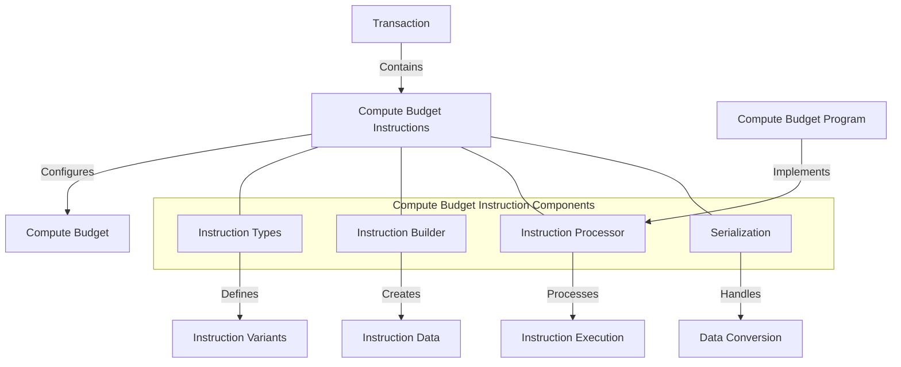

# Agave Compute Budget Instruction

The compute-budget-instruction module provides the instruction definitions for managing compute budgets in the Agave blockchain platform. It enables transactions to specify their computational resource requirements, set prioritization fees, and configure execution parameters.

## Architecture Overview



## Key Components

### Instruction Types
The Instruction Types component defines the available compute budget instructions:
- **SetComputeUnitLimit**: Sets the maximum number of compute units a transaction can consume
- **SetComputeUnitPrice**: Sets the price (in micro-lamports) per compute unit for transaction prioritization
- **SetLoadedAccountsDataSizeLimit**: Sets the maximum size of loaded accounts data
- **SetHeapFrame**: Sets the heap frame size for the transaction

### Instruction Builder
The Instruction Builder component provides methods for creating compute budget instructions:
- Creates instruction data with appropriate parameters
- Validates parameter ranges
- Handles parameter encoding
- Provides builder methods for instruction creation

### Instruction Processor
The Instruction Processor component handles the execution of compute budget instructions:
- Parses instruction data
- Updates the compute budget based on instruction parameters
- Validates instruction parameters
- Enforces parameter limits and constraints

### Serialization
The Serialization component handles data conversion for compute budget instructions:
- Serializes instruction parameters to binary format
- Deserializes binary data to instruction parameters
- Ensures backward compatibility
- Handles versioning of instruction formats

## Instruction Types

### SetComputeUnitLimit

Sets the maximum number of compute units that a transaction can consume.

```rust
// Create a SetComputeUnitLimit instruction
let units = 200_000;
let instruction = ComputeBudgetInstruction::set_compute_unit_limit(units);
```

### SetComputeUnitPrice

Sets the compute unit price in micro-lamports to pay for prioritization of the transaction.

```rust
// Create a SetComputeUnitPrice instruction
let micro_lamports = 10_000;
let instruction = ComputeBudgetInstruction::set_compute_unit_price(micro_lamports);
```

### SetLoadedAccountsDataSizeLimit

Sets the maximum size of loaded accounts data that a transaction can load.

```rust
// Create a SetLoadedAccountsDataSizeLimit instruction
let bytes = 64_000;
let instruction = ComputeBudgetInstruction::set_loaded_accounts_data_size_limit(bytes);
```

### SetHeapFrame

Sets the heap frame size for the transaction.

```rust
// Create a SetHeapFrame instruction
let bytes = 256 * 1024; // 256 KB
let instruction = ComputeBudgetInstruction::set_heap_frame(bytes);
```

## Usage Examples

### Setting Compute Unit Limit

```rust
use solana_compute_budget_instruction::ComputeBudgetInstruction;
use solana_sdk::{
    transaction::Transaction,
    signature::{Keypair, Signer},
};

// Create a compute unit limit instruction
let compute_unit_limit = 200_000;
let compute_budget_instruction = ComputeBudgetInstruction::set_compute_unit_limit(compute_unit_limit);

// Add the instruction to a transaction
let keypair = Keypair::new();
let blockhash = /* get recent blockhash */;
let transaction = Transaction::new_signed_with_payer(
    &[compute_budget_instruction, /* other instructions */],
    Some(&keypair.pubkey()),
    &[&keypair],
    blockhash,
);
```

### Setting Compute Unit Price for Prioritization

```rust
use solana_compute_budget_instruction::ComputeBudgetInstruction;
use solana_sdk::{
    transaction::Transaction,
    signature::{Keypair, Signer},
};

// Create a compute unit price instruction for prioritization
let compute_unit_price = 10_000; // 10,000 micro-lamports per compute unit
let prioritization_instruction = ComputeBudgetInstruction::set_compute_unit_price(compute_unit_price);

// Add the instruction to a transaction
let keypair = Keypair::new();
let blockhash = /* get recent blockhash */;
let transaction = Transaction::new_signed_with_payer(
    &[prioritization_instruction, /* other instructions */],
    Some(&keypair.pubkey()),
    &[&keypair],
    blockhash,
);
```

### Configuring Multiple Compute Budget Parameters

```rust
use solana_compute_budget_instruction::ComputeBudgetInstruction;
use solana_sdk::{
    transaction::Transaction,
    signature::{Keypair, Signer},
};

// Create compute budget instructions
let compute_unit_limit = 300_000;
let compute_unit_price = 5_000;
let loaded_accounts_data_size_limit = 128_000;

let limit_instruction = ComputeBudgetInstruction::set_compute_unit_limit(compute_unit_limit);
let price_instruction = ComputeBudgetInstruction::set_compute_unit_price(compute_unit_price);
let data_size_instruction = ComputeBudgetInstruction::set_loaded_accounts_data_size_limit(loaded_accounts_data_size_limit);

// Add the instructions to a transaction
let keypair = Keypair::new();
let blockhash = /* get recent blockhash */;
let transaction = Transaction::new_signed_with_payer(
    &[
        limit_instruction,
        price_instruction,
        data_size_instruction,
        /* other instructions */
    ],
    Some(&keypair.pubkey()),
    &[&keypair],
    blockhash,
);
```

### Using with RPC Client

```rust
use solana_compute_budget_instruction::ComputeBudgetInstruction;
use solana_sdk::{
    transaction::Transaction,
    signature::{Keypair, Signer},
};
use solana_client::rpc_client::RpcClient;

// Create a compute budget instruction
let compute_unit_limit = 200_000;
let compute_unit_price = 10_000;
let limit_instruction = ComputeBudgetInstruction::set_compute_unit_limit(compute_unit_limit);
let price_instruction = ComputeBudgetInstruction::set_compute_unit_price(compute_unit_price);

// Create an RPC client
let rpc_client = RpcClient::new("https://api.mainnet-beta.solana.com");

// Get a recent blockhash
let blockhash = rpc_client.get_latest_blockhash()?;

// Create and send a transaction
let keypair = Keypair::new();
let transaction = Transaction::new_signed_with_payer(
    &[
        limit_instruction,
        price_instruction,
        /* other instructions */
    ],
    Some(&keypair.pubkey()),
    &[&keypair],
    blockhash,
);

let signature = rpc_client.send_and_confirm_transaction(&transaction)?;
println!("Transaction signature: {}", signature);
```

## Integration with Other Components

The compute-budget-instruction module integrates with several other components of the Agave blockchain platform:

- **Compute Budget Program**: Implements the processing of compute budget instructions
- **Transaction Processor**: Uses compute budget instructions to configure transaction execution
- **Fee Calculator**: Uses compute budget parameters for fee calculation
- **Prioritization Fee Calculator**: Uses compute unit price for transaction prioritization
- **Runtime**: Enforces compute budget limits during transaction execution

## Development

### Building

To build the compute-budget-instruction module:

```bash
cd compute-budget-instruction
cargo build
```

### Testing

To run the tests for the compute-budget-instruction module:

```bash
cd compute-budget-instruction
cargo test
```

## Further Reading

For more detailed information about compute budgets and transaction prioritization, refer to the following resources:

- [Compute Budget Documentation](../compute-budget/README.md)
- [Transaction Processing](https://docs.anza.xyz/validator/transaction-processing)
- [Transaction Fees](https://docs.anza.xyz/economics/transaction-fees)
- [Prioritization Fees](https://docs.anza.xyz/economics/prioritization-fees)