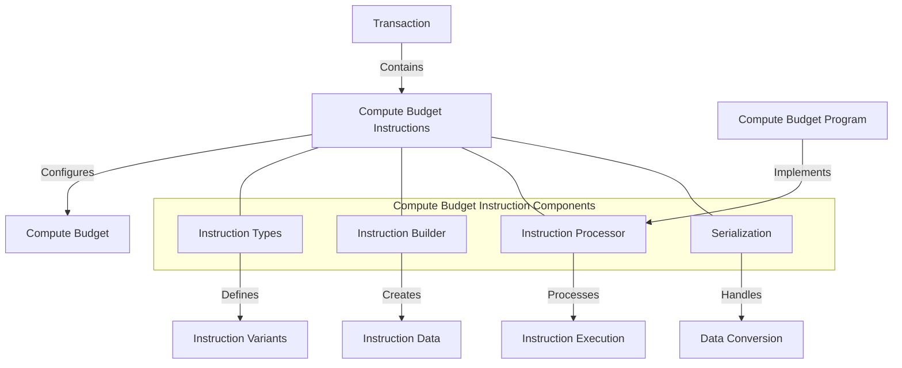

# uwuave compute budget instwuction

t-the compute-budget-instwuction m-moduwe pwovides t-the instwuction d-definitions fow m-managing compute b-budgets in the uwuave bwockchain p-pwatfowm. -.- it enabwes twansactions to specify theiw computationaw wesouwce wequiwements, (ˆ ﻌ ˆ)♡ s-set pwiowitization fees, (⑅˘꒳˘) and configuwe e-execution pawametews. (U ᵕ U❁)

## awchitectuwe o-ovewview

