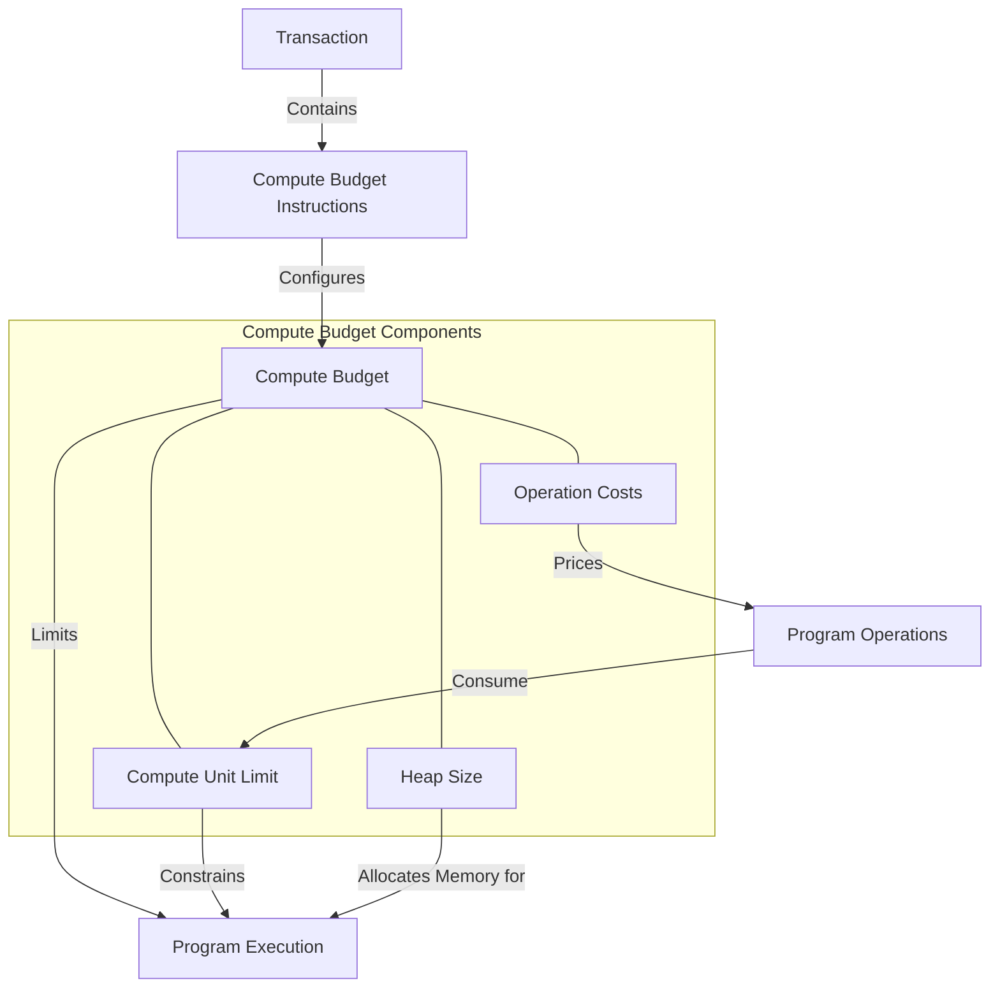

# Agave Compute Budget

The compute-budget module is a critical component of the Agave blockchain platform, responsible for defining and managing the computational resources available to programs running on the blockchain. It sets limits on various aspects of program execution, such as the number of compute units, heap size, and the cost of different operations.

## Architecture Overview



## Key Components

### ComputeBudget
The ComputeBudget structure defines the computational resources available to programs, including:
- Compute unit limit for the entire transaction
- Costs for various operations (e.g., SHA256, secp256k1_recover, log operations)
- Maximum instruction stack depth
- Maximum call depth
- Heap size
- Other execution constraints and costs

This structure is used by the runtime to track and limit the computational resources used by programs during execution.

### ComputeBudgetLimits
The ComputeBudgetLimits structure defines the limits for compute units, heap size, and other resources. It includes:
- Updated heap bytes
- Compute unit limit
- Compute unit price (for prioritization fees)
- Maximum loaded accounts data size

This structure is used to configure the compute budget for a transaction.

### Constants and Defaults
The module defines various constants and defaults, including:
- Default heap cost
- Default instruction compute unit limit
- Maximum compute unit limit
- Maximum and minimum heap frame bytes
- Maximum loaded accounts data size

These constants are used to set reasonable defaults and enforce limits on computational resources.

## Compute Unit Pricing

Compute units are the fundamental unit of computational resources in the Agave blockchain. Each operation consumes a specific number of compute units, and transactions are limited by the total number of compute units they can consume.

The pricing of different operations is carefully calibrated to reflect their actual computational cost, ensuring fair and efficient use of blockchain resources. For example:
- Simple operations like logging consume relatively few compute units
- Cryptographic operations like SHA256 or secp256k1_recover consume more compute units
- Complex operations like curve25519 point multiplication or alt_bn128 pairing consume even more compute units

## Prioritization Fees

Transactions can include a prioritization fee, which is calculated based on the compute unit price and the compute unit limit. This fee is used to prioritize transactions during periods of high network congestion.

The prioritization fee is calculated as:
```
prioritization_fee = (compute_unit_price * compute_unit_limit) / MICRO_LAMPORTS_PER_LAMPORT
```

Where MICRO_LAMPORTS_PER_LAMPORT is 1,000,000.

## Usage Examples

### Creating a Default Compute Budget

```rust
use solana_compute_budget::compute_budget::ComputeBudget;

// Create a default compute budget
let compute_budget = ComputeBudget::default();
```

### Creating a Compute Budget with a Custom Compute Unit Limit

```rust
use solana_compute_budget::compute_budget::ComputeBudget;

// Create a compute budget with a custom compute unit limit
let compute_unit_limit = 100_000;
let compute_budget = ComputeBudget::new(compute_unit_limit);
```

### Creating Compute Budget Limits

```rust
use solana_compute_budget::compute_budget_limits::ComputeBudgetLimits;

// Create default compute budget limits
let compute_budget_limits = ComputeBudgetLimits::default();

// Create custom compute budget limits
let compute_budget_limits = ComputeBudgetLimits {
    updated_heap_bytes: 32 * 1024, // 32 KB
    compute_unit_limit: 200_000,
    compute_unit_price: 10_000, // 10,000 micro-lamports per compute unit
    loaded_accounts_bytes: NonZeroU32::new(1_000_000).unwrap(), // 1 MB
};
```

### Calculating the Cost of Operations

```rust
use solana_compute_budget::compute_budget::ComputeBudget;

// Create a compute budget
let compute_budget = ComputeBudget::default();

// Calculate the cost of a SHA256 operation on 1000 bytes
let sha256_cost = compute_budget.sha256_base_cost + 
    compute_budget.sha256_byte_cost * 1000;

// Calculate the cost of a Poseidon hash with 3 inputs
let poseidon_cost = compute_budget.poseidon_cost(3).unwrap();
```

## Development

### Building

To build the compute-budget module:

```bash
cd compute-budget
cargo build
```

### Testing

To run the tests for the compute-budget module:

```bash
cd compute-budget
cargo test
```

## Further Reading

For more detailed information about the compute budget, refer to the following resources:

- [Transaction Processing](https://docs.anza.xyz/validator/transaction-processing)
- [Compute Budget Instructions](https://docs.anza.xyz/developing/programming-model/runtime)
- [Transaction Fees and Prioritization](https://docs.anza.xyz/economics/transaction-fees)
- [Program Execution](https://docs.anza.xyz/developing/programming-model/overview)