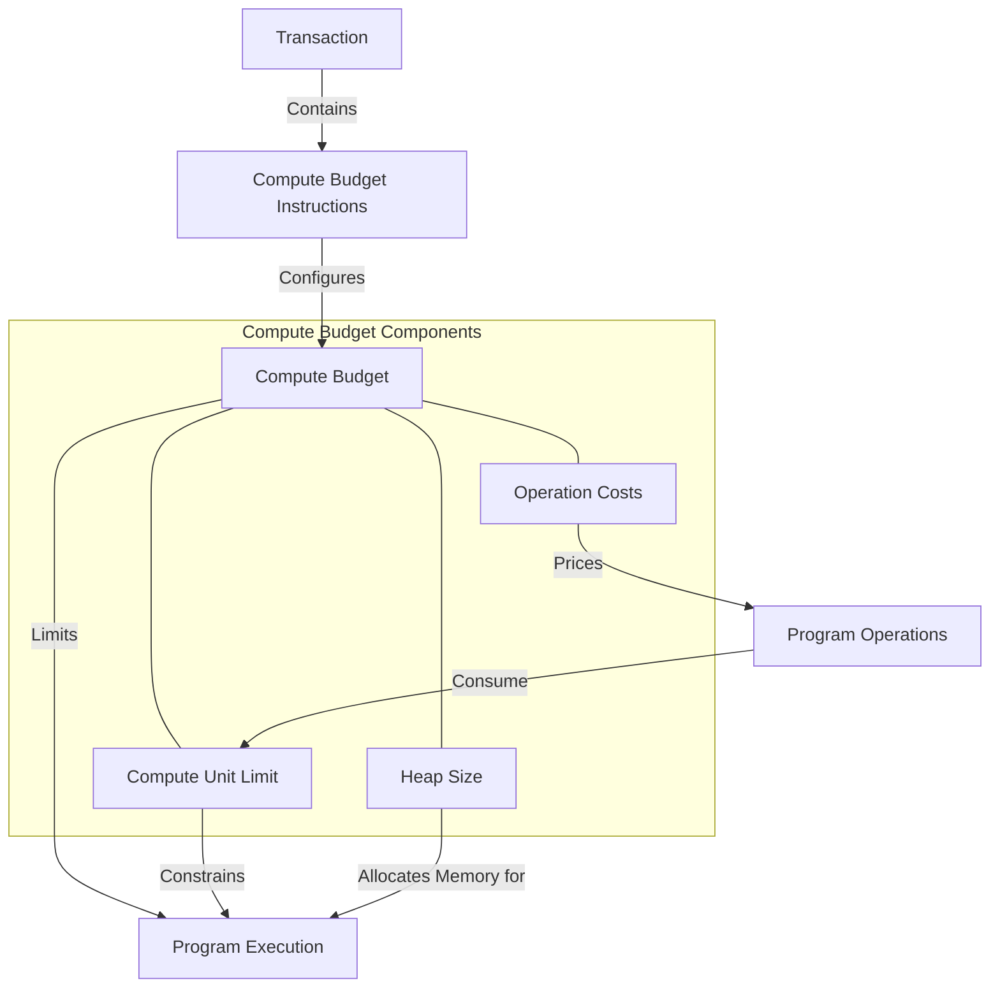

# uwuave compute budget

the compute-budget m-moduwe i-is a cwiticaw component o-of the uwuave bwockchain p-pwatfowm, -.- wesponsibwe f-fow defining a-and managing t-the computationaw wesouwces avaiwabwe to pwogwams wunning on the bwockchain. ^^;; it s-sets wimits on vawious aspects of pwogwam execution, >_< s-such as the nyumbew of compute u-units, mya heap size, and the cost of diffewent opewations. mya

## a-awchitectuwe ovewview

