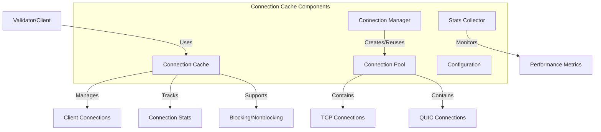

# Agave Connection Cache

The connection-cache module provides an efficient connection management system for the Agave blockchain platform. It handles the creation, pooling, and reuse of network connections between validators and clients, optimizing network performance and resource utilization.

## Architecture Overview



## Key Components

### Connection Cache
The Connection Cache is the main component that provides a high-level interface for managing connections. It maintains pools of connections to different endpoints and handles connection lifecycle management.

### Client Connection
The Client Connection component represents a network connection to a remote endpoint. It abstracts over different transport protocols (TCP, UDP, QUIC) and provides a unified interface for sending and receiving data.

### Connection Cache Stats
The Connection Cache Stats component collects and reports metrics about connection usage, such as:
- Number of connections created
- Number of connections reused
- Connection establishment time
- Connection errors
- Throughput and latency

### Nonblocking Module
The Nonblocking module provides asynchronous versions of the connection cache and client connection interfaces, allowing for non-blocking I/O operations in asynchronous contexts.

## Connection Management

The connection cache implements several strategies for efficient connection management:

### Connection Pooling
Connections are pooled and reused to avoid the overhead of establishing new connections for each request. This reduces latency and resource consumption.

### Connection Limits
The cache enforces limits on the number of connections to prevent resource exhaustion:
- Maximum connections per endpoint
- Maximum total connections
- Maximum idle time before connection cleanup

### Protocol Selection
The cache can automatically select the most appropriate protocol (TCP, UDP, QUIC) based on the type of data being sent, network conditions, and configuration preferences.

### Load Balancing
When multiple connections to the same endpoint are available, the cache can distribute load across them to maximize throughput and reliability.

## Performance Considerations

The connection-cache module is designed for high performance:

- **Connection Reuse**: Avoids the overhead of establishing new connections
- **Protocol Optimization**: Uses the most efficient protocol for each type of communication
- **Batching**: Supports batching multiple messages over a single connection
- **Pipelining**: Allows sending multiple requests without waiting for responses
- **Adaptive Timeouts**: Adjusts timeouts based on network conditions and historical performance

## Configuration

The connection cache can be configured with various parameters:

- **Connection Limits**: Maximum number of connections per endpoint and total
- **Idle Timeout**: How long to keep idle connections before closing them
- **Protocol Preferences**: Which protocols to prefer for different types of communication
- **Retry Parameters**: Settings for retrying failed connection attempts
- **Buffer Sizes**: Send and receive buffer sizes for connections

## Usage Examples

### Creating a Connection Cache

```rust
use solana_connection_cache::connection_cache::{ConnectionCache, ConnectionManager};
use solana_sdk::transport::TransportConfig;

// Create a connection cache with default settings
let connection_cache = ConnectionCache::default();

// Create a connection cache with custom settings
let connection_cache = ConnectionCache::new(
    "my-connection-cache",  // Name for metrics
    100,                    // Maximum connections
    TransportConfig::default(),
    ConnectionManager::default(),
);
```

### Sending Data Using the Cache

```rust
use solana_connection_cache::connection_cache::ConnectionCache;
use solana_sdk::transport::Result;

async fn send_data(
    connection_cache: &ConnectionCache,
    endpoint: SocketAddr,
    data: &[u8],
) -> Result<()> {
    // Get or create a connection to the endpoint
    let connection = connection_cache.get_connection(endpoint).await?;
    
    // Send data using the connection
    connection.send(data).await
}
```

### Using the Nonblocking Interface

```rust
use solana_connection_cache::nonblocking::connection_cache::ConnectionCache;
use tokio::runtime::Runtime;

// Create a tokio runtime
let runtime = Runtime::new().unwrap();

// Create a nonblocking connection cache
let connection_cache = ConnectionCache::default();

// Use the connection cache in an async context
runtime.block_on(async {
    let connection = connection_cache.get_connection(endpoint).await.unwrap();
    connection.send(data).await.unwrap();
});
```

## Development

### Building

To build the connection-cache module:

```bash
cd connection-cache
cargo build
```

### Testing

To run the tests for the connection-cache module:

```bash
cd connection-cache
cargo test
```

## Further Reading

For more detailed information about network communication in Agave, refer to the following resources:

- [Network Architecture](https://docs.anza.xyz/validator/network-architecture)
- [QUIC Protocol Support](https://docs.anza.xyz/validator/quic-support)
- [Performance Tuning](https://docs.anza.xyz/validator/performance-tuning)