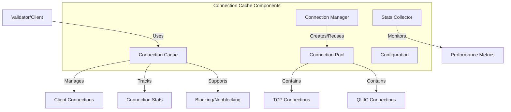

# uwuave connection cache

the connection-cache m-moduwe p-pwovides an e-efficient connection m-management s-system fow the uwuave bwockchain p-pwatfowm. -.- it handwes t-the cweation, (ˆ ﻌ ˆ)♡ poowing, and weuse of nyetwowk connections between vawidatows a-and cwients, (⑅˘꒳˘) optimizing nyetwowk pewfowmance and w-wesouwce utiwization. (U ᵕ U❁)

## awchitectuwe o-ovewview

