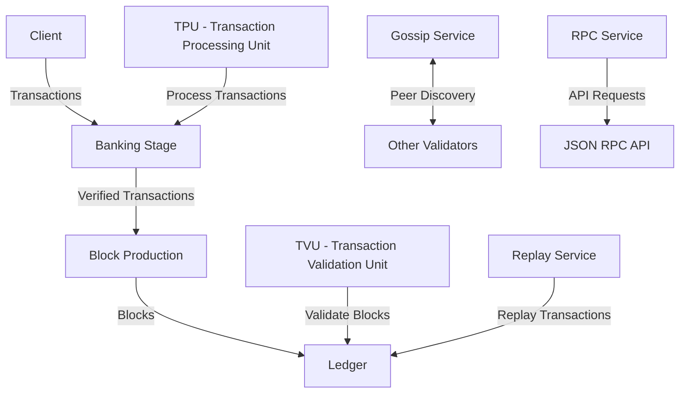

# Agave Core

The core module is the central component of the Agave blockchain platform, described as "Blockchain, Rebuilt for Scale." It contains the fundamental functionality for operating a blockchain node, including consensus, networking, transaction processing, and block production.

## Architecture Overview



## Key Components

### Banking Stage
The Banking Stage is responsible for processing and validating transactions before they are included in blocks. It performs various checks such as signature verification, account balance verification, and smart contract execution.

### Block Production
The Block Production component is responsible for creating new blocks that include validated transactions. It uses the Proof of Stake (PoS) consensus mechanism to determine which validator is allowed to produce the next block.

### Gossip Service
The Gossip Service enables peer discovery and communication between validators. It uses a gossip protocol to propagate information about the network, such as validator identities, block heights, and transaction status.

### Transaction Processing Unit (TPU)
The TPU is responsible for receiving and processing transactions from clients. It includes components for forwarding transactions to the Banking Stage and broadcasting them to other validators.

### Transaction Validation Unit (TVU)
The TVU is responsible for validating blocks received from other validators. It verifies that the blocks follow the consensus rules and updates the local ledger accordingly.

### RPC Service
The RPC Service provides an API for clients to interact with the blockchain. It supports various operations such as submitting transactions, querying account balances, and retrieving block information.

## Dependencies

The core module depends on several other components of the Agave platform:

- **accounts-db**: Manages the state of all accounts on the blockchain
- **ledger**: Stores and manages the blockchain data
- **runtime**: Provides the execution environment for transactions
- **svm**: Executes smart contracts
- **gossip**: Handles peer discovery and communication
- **vote**: Manages the voting process for consensus
- **perf**: Provides performance-related utilities
- **metrics**: Collects and reports performance metrics

## Usage

The core module is primarily used by the validator component, which integrates all the necessary components to run a full validator node. It is not intended to be used directly by end users.

## Development

### Building

To build the core module:

```bash
cd core
cargo build
```

### Testing

To run the tests for the core module:

```bash
cd core
cargo test
```

### Benchmarking

The core module includes benchmarks for performance-critical components:

```bash
cd core
cargo bench
```

## Further Reading

For more detailed information about the core components, refer to the following resources:

- [Agave Architecture Documentation](https://docs.anza.xyz/architecture)
- [Consensus Mechanism](https://docs.anza.xyz/implemented-proposals/tower-bft)
- [Transaction Processing](https://docs.anza.xyz/validator/transaction-processing)