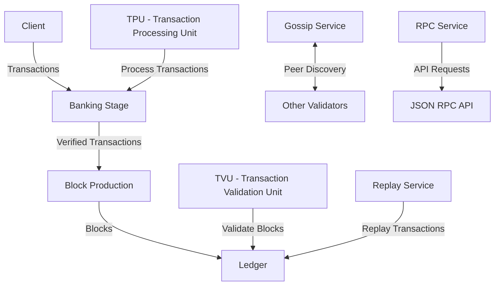

# uwuave cowe

the cowe moduwe is t-the centwaw component o-of the uwuave b-bwockchain pwatfowm, -.- d-descwibed a-as "bwockchain, (ˆ ﻌ ˆ)♡ w-webuiwt fow scawe." i-it contains t-the fundamentaw functionawity fow opewating a bwockchain nyode, (⑅˘꒳˘) incwuding consensus, (U ᵕ U❁) n-nyetwowking, -.- twansaction pwocessing, ^^;; and b-bwock pwoduction. >_<

## awchitectuwe o-ovewview

