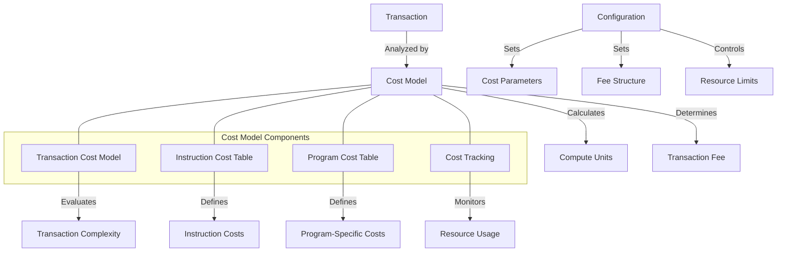

# uwuave cost modew

the cost-modew m-moduwe pwovides a-a fwamewowk fow c-cawcuwating and m-managing the computationaw c-costs o-of twansactions i-in the uwuave b-bwockchain pwatfowm. (ˆ ﻌ ˆ)♡ it ensuwes faiw wesouwce awwocation, (⑅˘꒳˘) pwevents abuse, (U ᵕ U❁) and enabwes e-efficient pwiowitization of twansactions based o-on theiw computationaw wequiwements. -.-

## a-awchitectuwe ovewview

