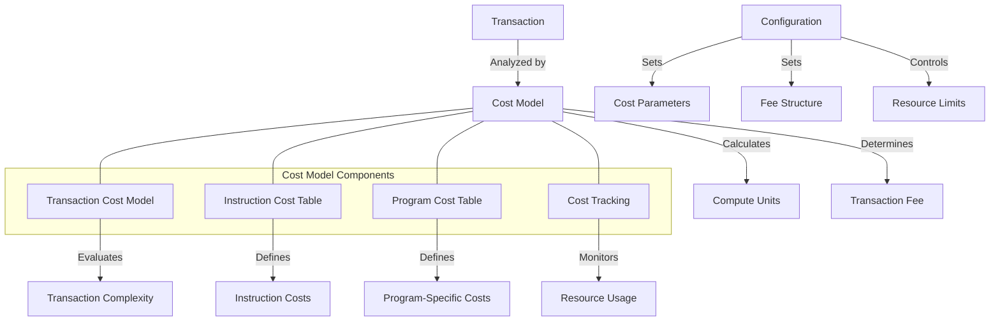

# Agave Cost Model

The cost-model module provides a framework for calculating and managing the computational costs of transactions in the Agave blockchain platform. It ensures fair resource allocation, prevents abuse, and enables efficient prioritization of transactions based on their computational requirements.

## Architecture Overview



## Key Components

### Transaction Cost Model
The Transaction Cost Model is responsible for:
- Analyzing transactions to determine their computational complexity
- Calculating the compute units required for execution
- Determining the appropriate transaction fee
- Enforcing resource limits to prevent abuse

### Instruction Cost Table
The Instruction Cost Table defines the base cost for different types of instructions:
- System program instructions (transfer, create account, etc.)
- Token program instructions (transfer, mint, etc.)
- Vote program instructions
- Other built-in program instructions
- Custom program instructions

### Program Cost Table
The Program Cost Table provides program-specific cost information:
- Costs for specific programs based on their computational requirements
- Adjustments for programs with unique resource usage patterns
- Historical data on program execution costs

### Cost Tracking
The Cost Tracking component monitors resource usage during transaction execution:
- Tracks compute unit consumption
- Records execution time
- Monitors memory usage
- Identifies resource-intensive operations

## Cost Calculation Mechanism

The cost model calculates transaction costs using the following approach:

1. **Base Cost**: Each transaction has a base cost for overhead
2. **Instruction Costs**: Each instruction adds cost based on its type and complexity
3. **Data Size Cost**: Additional cost based on the size of transaction data
4. **Account Access Cost**: Cost for accessing and modifying accounts
5. **Program Execution Cost**: Cost for executing program instructions
6. **Signatures Cost**: Cost for verifying transaction signatures

This mechanism ensures that:
- Complex transactions pay higher fees
- Resource-intensive operations are appropriately priced
- The network remains protected from spam and abuse
- Validators are compensated for their resources

## Usage Examples

### Calculating Transaction Cost

```rust
use solana_cost_model::cost_model::CostModel;
use solana_sdk::transaction::Transaction;

// Create a cost model
let cost_model = CostModel::default();

// Calculate the cost of a transaction
let transaction = /* create or get transaction */;
let cost = cost_model.calculate_cost(&transaction);

println!("Transaction cost in compute units: {}", cost);
```

### Estimating Transaction Fee

```rust
use solana_cost_model::cost_model::{CostModel, FeeStructure};
use solana_sdk::transaction::Transaction;

// Create a cost model with a specific fee structure
let fee_structure = FeeStructure {
    lamports_per_signature: 5000,
    ..FeeStructure::default()
};
let cost_model = CostModel::new(fee_structure);

// Estimate the fee for a transaction
let transaction = /* create or get transaction */;
let fee = cost_model.calculate_fee(&transaction);

println!("Estimated transaction fee: {} lamports", fee);
```

### Program-Specific Cost Analysis

```rust
use solana_cost_model::cost_model::CostModel;
use solana_sdk::pubkey::Pubkey;

// Create a cost model
let cost_model = CostModel::default();

// Get the cost statistics for a specific program
let program_id = Pubkey::from_str("TokenkegQfeZyiNwAJbNbGKPFXCWuBvf9Ss623VQ5DA").unwrap();
let stats = cost_model.get_program_cost_stats(&program_id);

println!("Program average cost: {}", stats.average_cost);
println!("Program max cost: {}", stats.max_cost);
println!("Program call count: {}", stats.call_count);
```

### Custom Cost Model Configuration

```rust
use solana_cost_model::cost_model::{CostModel, CostModelConfig};

// Create a custom cost model configuration
let config = CostModelConfig {
    instruction_base_cost: 200,
    signature_cost: 100,
    write_lock_cost: 50,
    data_bytes_cost: 5,
    builtins_execution_cost: 500,
    ..CostModelConfig::default()
};

// Create a cost model with the custom configuration
let cost_model = CostModel::new_with_config(config);
```

## Performance Considerations

The cost model is designed for efficiency and accuracy:

- **Low Overhead**: Cost calculations add minimal overhead to transaction processing
- **Predictable Costs**: Costs are deterministic and predictable for the same transaction
- **Adaptive Pricing**: The model can adapt to changing network conditions
- **Fine-Grained Control**: Provides detailed control over resource pricing
- **Historical Analysis**: Uses historical data to improve cost estimates

Performance implications:

- Cost calculations are performed during transaction validation
- The model balances accuracy with computational efficiency
- Cost parameters can be tuned to optimize network performance
- Historical data helps refine cost estimates over time

## Configuration

The cost model can be configured with various parameters:

- **Base Costs**: The base cost for transactions and instructions
- **Resource Costs**: Costs for CPU, memory, and storage usage
- **Fee Structure**: How costs translate to transaction fees
- **Program-Specific Costs**: Custom costs for specific programs
- **Resource Limits**: Maximum allowed resource usage

## Development

### Building

To build the cost-model module:

```bash
cd cost-model
cargo build
```

### Testing

To run the tests for the cost-model module:

```bash
cd cost-model
cargo test
```

## Further Reading

For more detailed information about the cost model and transaction fees, refer to the following resources:

- [Transaction Fees](https://docs.anza.xyz/economics/transaction-fees)
- [Compute Budget](https://docs.anza.xyz/developing/programming-model/runtime)
- [Resource Pricing](https://docs.anza.xyz/economics/resource-pricing)
- [Prioritization Fees](https://docs.anza.xyz/economics/prioritization-fees)