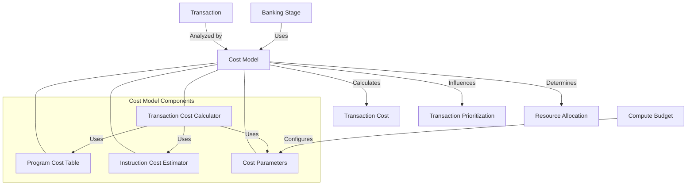

# Agave Cost Model

The cost-model module is a critical component of the Agave blockchain platform, responsible for calculating and managing the computational costs of transactions. It provides a framework for estimating the resources required to execute transactions, which is essential for fair fee calculation, prioritization, and resource allocation.

## Architecture Overview



## Key Components

### Transaction Cost Calculator
The Transaction Cost Calculator is the main component that calculates the overall cost of a transaction. It analyzes the transaction's instructions, accounts, and signatures to determine the computational resources required for execution.

### Program Cost Table
The Program Cost Table maintains the cost parameters for different programs on the blockchain. It provides program-specific cost estimates based on historical execution data and predefined cost models.

### Instruction Cost Estimator
The Instruction Cost Estimator calculates the cost of individual instructions within a transaction. It considers factors such as:
- Instruction complexity
- Number of accounts accessed
- Amount of data processed
- Program being invoked

### Cost Parameters
The Cost Parameters component defines the base costs for various operations, such as:
- Signature verification
- Write locks
- Account access
- Data transfer
- Program execution

These parameters are used to calculate the overall cost of a transaction.

## Cost Calculation Process

The cost calculation process follows these steps:

1. **Transaction Analysis**: The transaction is analyzed to identify its components (instructions, accounts, signatures)
2. **Base Cost Calculation**: A base cost is calculated based on the transaction's size and structure
3. **Instruction Cost Estimation**: The cost of each instruction is estimated based on its complexity and the program it invokes
4. **Account Access Cost**: Additional costs are added for account access, particularly for write operations
5. **Signature Verification Cost**: Costs for signature verification are added
6. **Total Cost Calculation**: All costs are summed to determine the total transaction cost

## Usage Examples

### Calculating Transaction Cost

```rust
use solana_cost_model::cost_model::CostModel;
use solana_sdk::transaction::Transaction;

// Create a cost model with default parameters
let cost_model = CostModel::default();

// Calculate the cost of a transaction
let transaction = /* create or get transaction */;
let transaction_cost = cost_model.calculate_cost(&transaction);

println!("Transaction cost: {} compute units", transaction_cost);
```

### Using Program-Specific Cost Models

```rust
use solana_cost_model::{cost_model::CostModel, program_costs::ProgramCostTable};
use solana_sdk::pubkey::Pubkey;

// Create a program cost table
let mut program_costs = ProgramCostTable::default();

// Set custom cost for a specific program
let program_id = Pubkey::new_unique();
let program_cost = 1000; // Cost in compute units
program_costs.set_program_cost(program_id, program_cost);

// Create a cost model with the custom program costs
let cost_model = CostModel::new(program_costs);
```

### Estimating Instruction Cost

```rust
use solana_cost_model::instruction_costs::InstructionCostEstimator;
use solana_sdk::instruction::Instruction;

// Create an instruction cost estimator
let instruction_cost_estimator = InstructionCostEstimator::default();

// Estimate the cost of an instruction
let instruction = /* create or get instruction */;
let instruction_cost = instruction_cost_estimator.estimate_cost(&instruction);

println!("Instruction cost: {} compute units", instruction_cost);
```

## Performance Considerations

The cost model is designed for efficiency and accuracy:

- **Caching**: Frequently used cost calculations are cached to improve performance
- **Incremental Updates**: Cost parameters can be updated incrementally based on network conditions
- **Adaptive Estimation**: Cost estimates adapt to changing execution patterns
- **Low Overhead**: The cost model adds minimal overhead to transaction processing

## Configuration

The cost model can be configured with various parameters:

- **Base Costs**: The base costs for different operations
- **Program-Specific Costs**: Custom costs for specific programs
- **Scaling Factors**: Factors to scale costs based on network conditions
- **Update Frequency**: How often cost parameters are updated

## Development

### Building

To build the cost-model module:

```bash
cd cost-model
cargo build
```

### Testing

To run the tests for the cost-model module:

```bash
cd cost-model
cargo test
```

## Further Reading

For more detailed information about the cost model, refer to the following resources:

- [Transaction Fees](https://docs.anza.xyz/economics/transaction-fees)
- [Compute Budget](https://docs.anza.xyz/developing/programming-model/runtime)
- [Transaction Prioritization](https://docs.anza.xyz/validator/transaction-prioritization)
- [Resource Allocation](https://docs.anza.xyz/validator/resource-allocation)