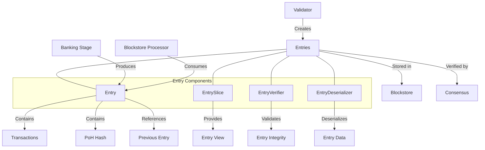

# Agave Entry Module

The entry module is a fundamental component of the Agave blockchain platform that defines and manages the structure of blockchain entries. Entries are the basic building blocks of the blockchain, containing transactions and proof-of-history hashes that form the immutable ledger.

## Architecture Overview



## Key Components

### Entry
The Entry structure is the core component that represents a single entry in the blockchain. Each Entry contains:
- A hash that depends on the previous entry's hash (PoH hash)
- A vector of transactions to be processed
- Metadata about the entry, such as its position in the blockchain

### EntrySlice
The EntrySlice provides a view into a sequence of entries, enabling efficient operations on multiple entries without copying data. It supports:
- Iterating over entries
- Accessing entry properties
- Performing batch operations

### EntryVerifier
The EntryVerifier is responsible for validating entries, ensuring:
- Each entry correctly references the previous entry
- The hash chain is valid
- Transactions within entries are well-formed
- Entry metadata is consistent

### EntryDeserializer
The EntryDeserializer handles the conversion of serialized entry data back into Entry objects, supporting:
- Efficient deserialization
- Error handling for malformed data
- Version compatibility

## Entry Structure

An Entry in the Agave blockchain consists of:

1. **Hash**: A SHA-256 hash that depends on the previous entry's hash, forming the PoH chain
2. **Num Hashes**: The number of hashing operations performed since the previous entry
3. **Transactions**: A vector of transactions included in this entry
4. **Tick**: A boolean indicating whether this entry is a tick (empty entry used for timing)

Entries are linked together through their hashes, forming a cryptographically verifiable chain that provides both ordering and timing information.

## Usage Examples

### Creating an Entry

```rust
use solana_entry::entry::{Entry, next_entry};
use solana_sdk::{hash::Hash, transaction::Transaction};

// Create an initial entry (usually a tick)
let previous_hash = Hash::default();
let num_hashes = 1;
let entry = next_entry(&previous_hash, num_hashes, vec![]);

// Create an entry with transactions
let transactions = vec![transaction1, transaction2, transaction3];
let next_entry = next_entry(&entry.hash, num_hashes, transactions);
```

### Creating a Series of Entries

```rust
use solana_entry::entry::{Entry, next_entry, next_entry_mut};
use solana_sdk::{hash::Hash, transaction::Transaction};

// Start with an initial hash
let mut hash = Hash::default();
let num_hashes = 1;

// Create a series of entries
let mut entries = Vec::new();

// Create a tick entry
let tick = next_entry(&hash, num_hashes, vec![]);
hash = tick.hash;
entries.push(tick);

// Create an entry with transactions
let transactions = vec![transaction1, transaction2];
let entry = next_entry(&hash, num_hashes, transactions);
hash = entry.hash;
entries.push(entry);

// Create another entry with transactions
let more_transactions = vec![transaction3, transaction4];
let another_entry = next_entry(&hash, num_hashes, more_transactions);
entries.push(another_entry);
```

### Verifying Entries

```rust
use solana_entry::entry::{Entry, verify_entries};
use solana_sdk::hash::Hash;

// Get a slice of entries to verify
let entries: Vec<Entry> = /* get entries from somewhere */;

// Verify the entry chain
let start_hash = /* starting hash */;
let result = verify_entries(start_hash, &entries);

if result {
    println!("Entries verified successfully");
} else {
    println!("Entry verification failed");
}
```

### Working with EntrySlice

```rust
use solana_entry::entry::{Entry, EntrySlice};

// Get a vector of entries
let entries: Vec<Entry> = /* get entries from somewhere */;

// Use EntrySlice methods
let num_transactions = entries.num_transactions();
let num_ticks = entries.num_ticks();

// Verify the slice
let start_hash = /* starting hash */;
let result = entries.verify(&start_hash);

// Get all transactions
let transactions = entries.get_transactions();
```

## Performance Considerations

The entry module is designed for high performance:

- **Efficient Serialization**: Entries use an efficient binary serialization format
- **Zero-Copy Operations**: EntrySlice enables operations without copying data
- **Batch Processing**: Multiple entries can be processed together for improved throughput
- **Parallel Verification**: Entry verification can be parallelized for better performance
- **Optimized Hashing**: Uses optimized SHA-256 implementations for PoH hashing

Performance characteristics:

- Entry creation is O(1) with respect to the number of entries
- Entry verification is O(n) where n is the number of entries
- Transaction extraction is O(m) where m is the total number of transactions

## Integration with Other Components

The entry module integrates with several other components of the Agave blockchain:

- **Banking Stage**: Produces entries containing validated transactions
- **Blockstore**: Stores entries persistently on disk
- **Consensus**: Uses entries to determine the canonical chain
- **Replay Engine**: Replays entries to reconstruct the blockchain state
- **Validator**: Processes entries to update the ledger

## Development

### Building

To build the entry module:

```bash
cd entry
cargo build
```

### Testing

To run the tests for the entry module:

```bash
cd entry
cargo test
```

## Further Reading

For more detailed information about entries and their role in the Agave blockchain, refer to the following resources:

- [Blockchain Structure](https://docs.anza.xyz/validator/blockchain-structure)
- [Proof of History](https://docs.anza.xyz/implemented-proposals/poh)
- [Transaction Processing](https://docs.anza.xyz/validator/transaction-processing)
- [Blockstore Architecture](https://docs.anza.xyz/validator/blockstore)