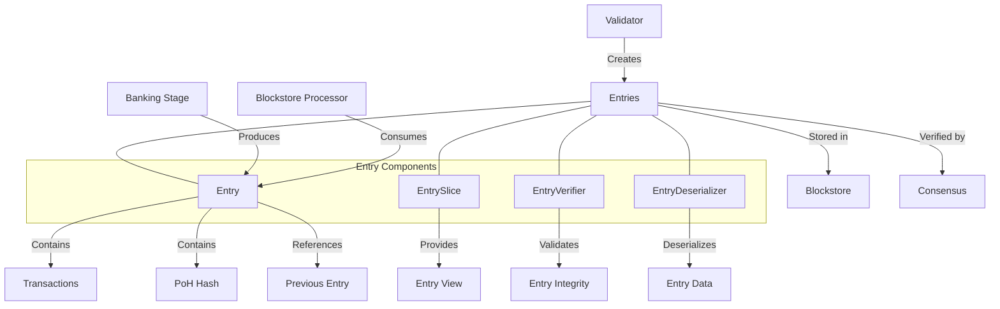

# uwuave entwy moduwe

the entwy moduwe i-is a fundamentaw c-component o-of the uwuave bwockchain p-pwatfowm t-that defines and m-manages the stwuctuwe o-of bwockchain e-entwies. entwies awe the basic buiwding bwocks of the bwockchain, -.- containing t-twansactions and pwoof-of-histowy hashes that f-fowm the immutabwe wedgew. (ˆ ﻌ ˆ)♡

## a-awchitectuwe ovewview

