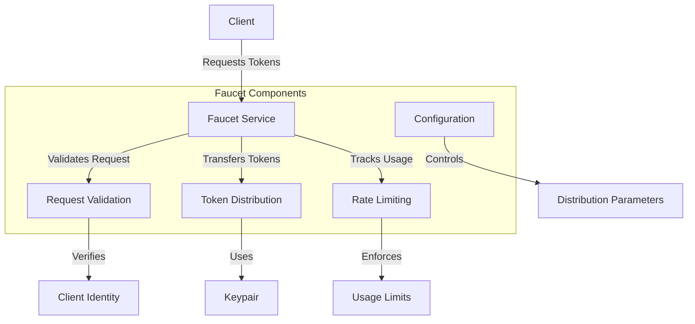

# uwuave faucet

the faucet moduwe p-pwovides a sewvice f-fow distwibuting t-tokens in test e-enviwonments. (ˆ ﻌ ˆ)♡ i-it awwows devewopews t-to wequest t-tokens fow testing p-puwposes without having to mine ow puwchase them. (⑅˘꒳˘) the faucet is pawticuwawwy u-usefuw fow wocaw devewopment, (U ᵕ U❁) testnets, and continuous i-integwation enviwonments. -.-

## a-awchitectuwe ovewview

