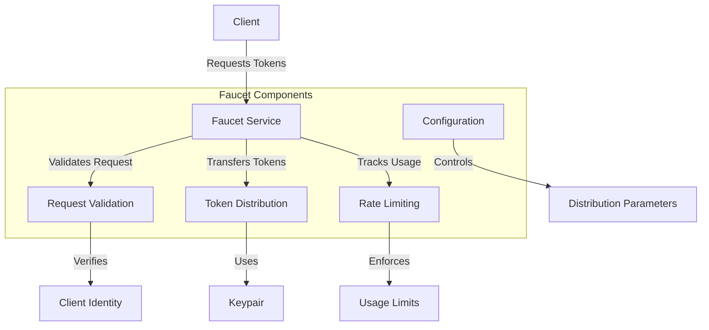

# Agave Faucet

The faucet module provides a service for distributing tokens in test environments. It allows developers to request tokens for testing purposes without having to mine or purchase them. The faucet is particularly useful for local development, testnets, and continuous integration environments.

## Architecture Overview



## Key Components

### Faucet Service
The Faucet Service is the main component that handles token distribution requests. It listens for incoming requests, validates them, and distributes tokens accordingly.

### Request Validation
The Request Validation component verifies the validity of token requests, including:
- Checking that the recipient address is valid
- Verifying any required authentication
- Validating the requested amount is within allowed limits

### Token Distribution
The Token Distribution component handles the actual transfer of tokens to recipients. It creates and submits transactions to the blockchain to transfer tokens from the faucet account to the recipient.

### Rate Limiting
The Rate Limiting component enforces usage limits to prevent abuse of the faucet service. It tracks requests by various identifiers (IP address, account, etc.) and limits the frequency and amount of tokens that can be requested.

### Configuration
The Configuration component allows customization of the faucet service, including:
- Maximum tokens per request
- Time-based rate limits
- Authentication requirements
- Network and RPC endpoint configuration

## Usage Examples

### Starting the Faucet Service

```bash
# Start the faucet service with default settings
solana-faucet

# Start with custom settings
solana-faucet \
  --keypair /path/to/faucet-keypair.json \
  --url http://localhost:8899 \
  --per-time-cap 10 \
  --per-request-cap 1
```

### Requesting Tokens via CLI

```bash
# Request 1 SOL from the faucet
solana airdrop 1 recipient_address --url http://localhost:9900

# Request the maximum amount
solana airdrop --url http://localhost:9900
```

### Requesting Tokens via HTTP API

```bash
# Request tokens using curl
curl -X POST -H "Content-Type: application/json" \
  -d '{"jsonrpc":"2.0", "id":1, "method":"requestAirdrop", "params":["recipient_address", 1000000000]}' \
  http://localhost:9900
```

### Programmatic Usage

```rust
use solana_client::rpc_client::RpcClient;
use solana_sdk::{
    pubkey::Pubkey,
    signature::{Keypair, Signer},
};

// Connect to the RPC endpoint
let rpc_client = RpcClient::new("http://localhost:8899".to_string());

// Request airdrop
let recipient = Keypair::new();
let amount = 1_000_000_000; // 1 SOL in lamports
let signature = rpc_client.request_airdrop(&recipient.pubkey(), amount)?;

// Confirm transaction
rpc_client.confirm_transaction(&signature)?;

println!("Airdrop successful! New balance: {}", 
    rpc_client.get_balance(&recipient.pubkey())?);
```

## Configuration Options

The faucet service can be configured with various command-line options:

| Option | Description | Default |
|--------|-------------|---------|
| `--keypair` | Path to the faucet keypair | `~/.config/solana/id.json` |
| `--url` | RPC URL to the validator | `http://127.0.0.1:8899` |
| `--per-time-cap` | Maximum amount of tokens per time period | `500` |
| `--per-request-cap` | Maximum amount of tokens per request | `100` |
| `--time-slice` | Time period for rate limiting (in seconds) | `3600` |
| `--bind-address` | IP address to bind the faucet service | `0.0.0.0` |
| `--port` | Port to bind the faucet service | `9900` |

## Security Considerations

When deploying a faucet service, consider the following security aspects:

- **Token Supply**: Ensure the faucet account has sufficient tokens for expected usage
- **Rate Limiting**: Implement appropriate rate limits to prevent abuse
- **Network Exposure**: Consider network-level protections if exposing the faucet publicly
- **Keypair Security**: Protect the faucet keypair from unauthorized access
- **Monitoring**: Monitor faucet usage for unusual patterns

## Development

### Building

To build the faucet module:

```bash
cd faucet
cargo build
```

For a release build:

```bash
cd faucet
cargo build --release
```

### Testing

To run the tests for the faucet module:

```bash
cd faucet
cargo test
```

## Deployment

### Local Development

For local development, the faucet can be run alongside a local test validator:

```bash
# Start a local validator
solana-test-validator

# In another terminal, start the faucet
solana-faucet --url http://127.0.0.1:8899
```

### Testnet Deployment

For testnet deployments, consider:

1. Using a dedicated machine or container
2. Setting up monitoring and alerts
3. Implementing additional rate limiting or authentication
4. Regularly replenishing the faucet account

## Further Reading

For more detailed information about the faucet, refer to the following resources:

- [Local Development Guide](https://docs.anza.xyz/developing/test-validator)
- [Testnet Information](https://docs.anza.xyz/clusters/testnet)
- [RPC API Reference](https://docs.anza.xyz/api/http)