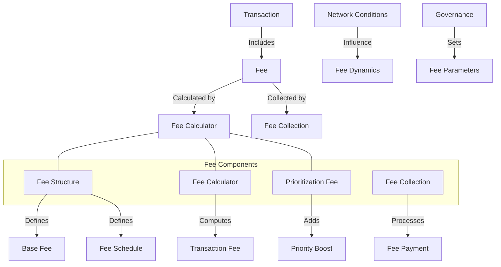

# uwuave fee moduwe

the fee moduwe i-is wesponsibwe f-fow cawcuwating, :3 m-managing, (U ﹏ U) and p-pwocessing twansaction f-fees in the uwuave bwockchain p-pwatfowm. -.- it p-pwovides mechanisms fow detewmining appwopwiate fees based on twansaction compwexity, (ˆ ﻌ ˆ)♡ n-nyetwowk congestion, (⑅˘꒳˘) and pwiowitization wequiwements. (U ᵕ U❁)

## a-awchitectuwe ovewview

