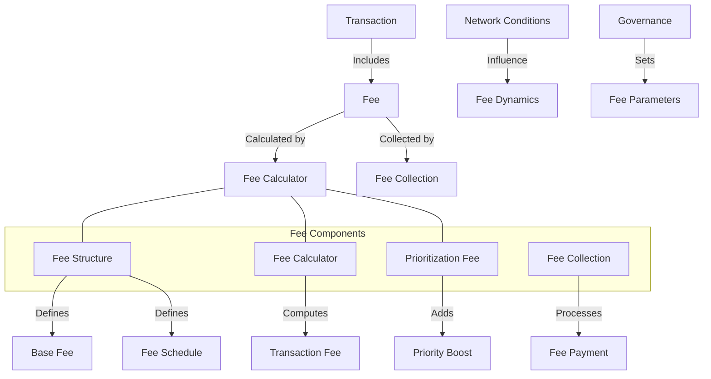

# Agave Fee Module

The fee module is responsible for calculating, managing, and processing transaction fees in the Agave blockchain platform. It provides mechanisms for determining appropriate fees based on transaction complexity, network congestion, and prioritization requirements.

## Architecture Overview



## Key Components

### Fee Structure
The Fee Structure component defines the fundamental fee model for the blockchain:
- Base fee for different transaction types
- Fee schedule for various operations
- Signature verification costs
- Write operation costs
- Compute unit costs

### Fee Calculator
The Fee Calculator component computes transaction fees based on:
- Transaction size and complexity
- Number of signatures
- Number of write operations
- Compute units consumed
- Current network conditions

### Prioritization Fee
The Prioritization Fee component handles additional fees for transaction prioritization:
- Allows users to pay extra for faster processing
- Dynamically adjusts based on network congestion
- Provides a market-based mechanism for transaction ordering
- Helps prevent spam during high-demand periods

### Fee Collection
The Fee Collection component manages the process of collecting fees:
- Verifies fee payment during transaction validation
- Distributes fees to validators
- Handles fee exemptions for certain accounts or programs
- Processes fee-related errors

## Fee Calculation Mechanism

The fee calculation mechanism determines transaction fees using the following approach:

1. **Base Fee**: Start with a base fee for the transaction
2. **Signature Cost**: Add cost for each signature in the transaction
3. **Write Operation Cost**: Add cost for each write operation
4. **Compute Unit Cost**: Add cost based on compute units consumed
5. **Prioritization Fee**: Add any user-specified prioritization fee
6. **Fee Adjustment**: Apply any network-based fee adjustments

This mechanism ensures that:
- More complex transactions pay higher fees
- Fees reflect the actual resource usage
- Users can prioritize transactions when needed
- The network remains protected from spam and abuse

## Usage Examples

### Calculating Transaction Fee

```rust
use solana_fee::fee_calculator::FeeCalculator;
use solana_sdk::transaction::Transaction;

// Create a fee calculator with default parameters
let fee_calculator = FeeCalculator::default();

// Calculate the fee for a transaction
let transaction = /* create or get transaction */;
let fee = fee_calculator.calculate_fee(&transaction);

println!("Transaction fee: {} lamports", fee);
```

### Adding a Prioritization Fee

```rust
use solana_fee::prioritization_fee::{PrioritizationFeeType, PrioritizationFeeCalculator};
use solana_sdk::transaction::Transaction;

// Create a transaction
let mut transaction = /* create transaction */;

// Add a prioritization fee (in micro-lamports per compute unit)
let prioritization_fee = 1000; // 1000 micro-lamports per compute unit
let compute_budget = 200_000; // 200,000 compute units

// Calculate the total prioritization fee
let fee_calculator = PrioritizationFeeCalculator::new(PrioritizationFeeType::Fixed(prioritization_fee));
let total_prioritization_fee = fee_calculator.calculate_fee(compute_budget);

// Add the prioritization fee instruction to the transaction
transaction.add_prioritization_fee(prioritization_fee);

println!("Added prioritization fee: {} lamports", total_prioritization_fee);
```

### Checking Fee Exemption

```rust
use solana_fee::fee_calculator::FeeCalculator;
use solana_sdk::pubkey::Pubkey;

// Create a fee calculator
let fee_calculator = FeeCalculator::default();

// Check if an account is exempt from fees
let account = Pubkey::from_str("83astBRguLMdt2h5U1Tpdq5tjFoJ6noeGwaY3mDLVcri").unwrap();
let is_exempt = fee_calculator.is_exempt(&account);

if is_exempt {
    println!("Account is exempt from fees");
} else {
    println!("Account is not exempt from fees");
}
```

### Fee Distribution

```rust
use solana_fee::fee_distributor::FeeDistributor;
use solana_sdk::pubkey::Pubkey;

// Create a fee distributor
let fee_distributor = FeeDistributor::default();

// Distribute collected fees to validators
let validators = /* get list of validators */;
let collected_fees = 1_000_000; // 0.001 SOL in lamports

// Distribute fees based on stake weight
let distribution = fee_distributor.distribute(collected_fees, &validators);

// Print the distribution
for (validator, amount) in distribution {
    println!("Validator {}: {} lamports", validator, amount);
}
```

## Fee Dynamics

The Agave blockchain implements dynamic fee mechanisms to adapt to changing network conditions:

- **Congestion-Based Adjustment**: Fees increase during periods of high network congestion
- **Resource-Based Pricing**: Fees reflect the actual resources consumed by transactions
- **Market-Based Prioritization**: Users can pay extra for priority processing
- **Governance Control**: Fee parameters can be adjusted through governance

These dynamics ensure that:
- The network remains accessible during varying load conditions
- Resources are allocated efficiently
- Users have options for transaction prioritization
- The fee model can evolve with the network's needs

## Configuration

The fee module can be configured with various parameters:

- **Base Fee**: The minimum fee for a transaction
- **Lamports Per Signature**: The cost per signature in a transaction
- **Write Lock Cost**: The cost for each write lock
- **Compute Unit Cost**: The cost per compute unit
- **Fee Exemptions**: Accounts or programs exempt from fees
- **Fee Distribution**: How fees are distributed to validators

## Development

### Building

To build the fee module:

```bash
cd fee
cargo build
```

### Testing

To run the tests for the fee module:

```bash
cd fee
cargo test
```

## Further Reading

For more detailed information about transaction fees, refer to the following resources:

- [Transaction Fees](https://docs.anza.xyz/economics/transaction-fees)
- [Prioritization Fees](https://docs.anza.xyz/economics/prioritization-fees)
- [Fee Market](https://docs.anza.xyz/economics/fee-market)
- [Validator Economics](https://docs.anza.xyz/economics/validator-economics)