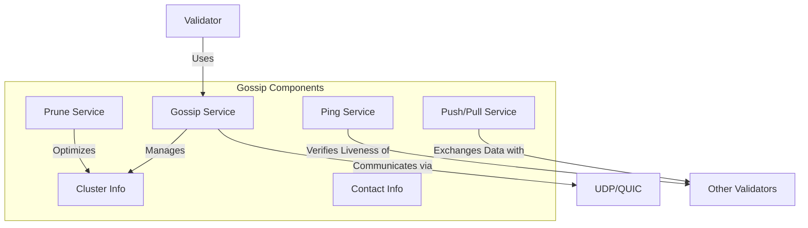

# Agave Gossip Protocol

The gossip module implements the peer-to-peer communication protocol used by Agave validators to discover each other and exchange network information. It is a critical component for maintaining network connectivity and propagating important data across the network.

## Architecture Overview



## Key Components

### Gossip Service
The Gossip Service is the main component that orchestrates the gossip protocol. It manages the cluster information, handles network communication, and provides an interface for other components to access network data.

### Cluster Info
The Cluster Info component maintains the validator's view of the network, including:
- Active validators and their contact information
- Network topology
- Votes and slot information
- Epoch information
- Other network metadata

### Push/Pull Service
The Push/Pull Service is responsible for exchanging data with other validators:
- **Push**: Proactively sends updates to other validators
- **Pull**: Requests updates from other validators
- **Flood**: Rapidly propagates critical information to all known validators

### Prune Service
The Prune Service optimizes the network by:
- Removing inactive validators from the contact list
- Limiting the number of connections to maintain optimal network performance
- Prioritizing connections based on network topology and stake

### Ping Service
The Ping Service verifies the liveness of other validators by:
- Sending ping messages to validators
- Tracking response times
- Identifying unresponsive validators

## Protocol Details

### Contact Information
Each validator advertises its contact information, which includes:
- Public key (identity)
- Network addresses (IP, ports)
- Version information
- Features supported
- Stake information

### Message Types
The gossip protocol uses several message types:
- **PushMessage**: Contains updates to be propagated
- **PullRequest**: Requests updates from another validator
- **PullResponse**: Responds to a pull request with updates
- **Ping**: Verifies liveness of another validator
- **Pong**: Responds to a ping message

### Network Optimization
The gossip protocol includes several optimizations:
- **Weighted Selection**: Prioritizes communication with validators based on stake
- **Bloom Filters**: Efficiently tracks which validators have received which messages
- **Incremental Updates**: Sends only new or changed information
- **Adaptive Timing**: Adjusts communication frequency based on network conditions

## Usage Examples

### Starting the Gossip Service

```rust
use solana_gossip::gossip_service::GossipService;
use solana_gossip::cluster_info::ClusterInfo;
use solana_sdk::signature::{Keypair, Signer};

// Create a keypair for the validator identity
let identity_keypair = Keypair::new();

// Create cluster info
let cluster_info = ClusterInfo::new(
    contact_info,
    identity_keypair.clone(),
    gossip_validators,
);

// Start gossip service
let gossip_service = GossipService::new(
    &cluster_info,
    None,
    gossip_socket,
    None,
    true,
);
```

### Discovering Validators

```rust
use solana_gossip::cluster_info::ClusterInfo;

// Get all validators in the network
let validators = cluster_info.all_peers();

// Get validators with specific feature
let feature_set = vec![123]; // Example feature ID
let validators_with_feature = cluster_info.get_nodes_with_feature(&feature_set);
```

### Broadcasting Information

```rust
use solana_gossip::cluster_info::ClusterInfo;

// Broadcast a message to all validators
cluster_info.push_message(message);

// Broadcast a message to specific validators
cluster_info.push_message_to_validators(message, &validator_list);
```

## Performance Considerations

The gossip protocol is designed for efficiency and scalability:
- **Low Bandwidth Usage**: Minimizes network traffic through incremental updates and compression
- **Scalability**: Scales to thousands of validators through pruning and weighted selection
- **Resilience**: Continues to function even with partial network connectivity
- **Security**: Authenticates all messages to prevent spoofing and tampering

## Configuration

The gossip service can be configured with various parameters:
- **Gossip Interval**: How frequently to exchange information
- **Prune Interval**: How frequently to prune the contact list
- **Ping Interval**: How frequently to ping other validators
- **Fanout Size**: How many validators to contact during each push/pull cycle
- **Max Connections**: Maximum number of simultaneous connections

## Development

### Building

To build the gossip module:

```bash
cd gossip
cargo build
```

### Testing

To run the tests for the gossip module:

```bash
cd gossip
cargo test
```

## Further Reading

For more detailed information about the gossip protocol, refer to the following resources:

- [Network Architecture](https://docs.anza.xyz/validator/gossip)
- [Cluster Management](https://docs.anza.xyz/validator/cluster-management)
- [Validator Requirements](https://docs.anza.xyz/running-validator/validator-reqs)