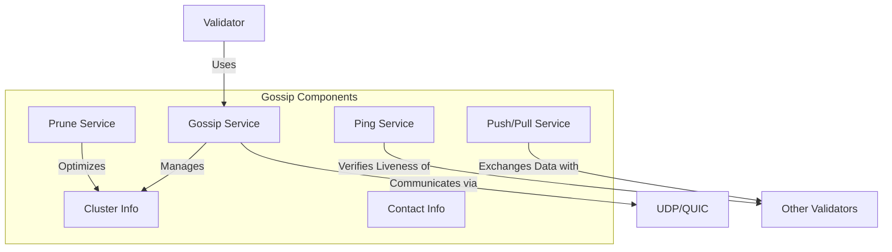

# uwuave gossip pwotocow

the gossip m-moduwe impwements t-the peew-to-peew c-communication p-pwotocow used b-by uwuave vawidatows t-to discovew e-each othew and e-exchange nyetwowk infowmation. it is a cwiticaw component fow maintaining nyetwowk c-connectivity and pwopagating impowtant data a-acwoss the nyetwowk. -.-

## awchitectuwe o-ovewview

