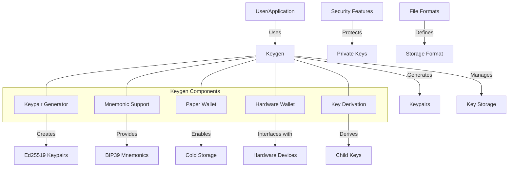

# Agave Keygen

The keygen module provides tools and libraries for generating, managing, and securing cryptographic keypairs in the Agave blockchain platform. It enables the creation of wallet keypairs, validator identities, and other cryptographic materials essential for secure blockchain operations.

## Architecture Overview



## Key Components

### Keypair Generator
The Keypair Generator component creates cryptographic keypairs:
- Generates secure random Ed25519 keypairs
- Creates deterministic keypairs from seeds
- Supports various output formats (JSON, raw bytes, base58)
- Provides utilities for key conversion and validation

### Mnemonic Support
The Mnemonic Support component implements BIP39 mnemonic phrases:
- Generates random mnemonic phrases
- Converts between mnemonics and seeds
- Supports multiple languages
- Implements passphrase protection

### Paper Wallet
The Paper Wallet component enables offline key storage:
- Generates printable paper wallets
- Creates QR codes for public keys
- Implements seed phrases for recovery
- Provides tools for secure offline usage

### Hardware Wallet
The Hardware Wallet component interfaces with hardware security devices:
- Supports Ledger devices
- Enables key derivation on hardware
- Implements transaction signing via hardware
- Provides device management utilities

### Key Derivation
The Key Derivation component implements hierarchical deterministic key derivation:
- Supports BIP32/BIP44 derivation paths
- Enables multiple accounts from a single seed
- Provides vanity address generation
- Implements key rotation mechanisms

## Usage Examples

### Generating a New Keypair

```rust
use solana_keygen::keypair::{Keypair, write_keypair_file};
use std::path::Path;

// Generate a new random keypair
let keypair = Keypair::new();
println!("Generated keypair with pubkey: {}", keypair.pubkey());

// Save the keypair to a file
let keypair_file = Path::new("my-keypair.json");
write_keypair_file(&keypair, keypair_file).unwrap();
println!("Saved keypair to: {}", keypair_file.display());
```

### Creating a Keypair from a Seed Phrase

```rust
use solana_keygen::mnemonic::{Mnemonic, Seed};
use solana_keygen::keypair::Keypair;

// Generate a new mnemonic phrase
let mnemonic = Mnemonic::new(12, "").unwrap();
println!("Generated mnemonic: {}", mnemonic.phrase());

// Create a seed from the mnemonic with an optional passphrase
let seed = Seed::new(&mnemonic, "optional passphrase");

// Derive a keypair from the seed
let keypair = Keypair::from_seed(seed.as_bytes()).unwrap();
println!("Derived keypair with pubkey: {}", keypair.pubkey());
```

### Generating a Paper Wallet

```rust
use solana_keygen::paper_wallet::{PaperWallet, PaperWalletConfig};

// Configure the paper wallet
let config = PaperWalletConfig {
    mnemonic_word_count: 24,
    passphrase_protection: true,
    qr_code: true,
};

// Generate a paper wallet
let paper_wallet = PaperWallet::new(config);

// Print the paper wallet
let wallet_text = paper_wallet.to_string();
println!("{}", wallet_text);

// Save the paper wallet as a PDF
paper_wallet.save_pdf("my-paper-wallet.pdf").unwrap();
```

### Using a Hardware Wallet

```rust
use solana_keygen::hardware_wallet::{HardwareWallet, LedgerWallet};
use solana_keygen::remote_wallet::RemoteWalletManager;

// Initialize the remote wallet manager
let manager = RemoteWalletManager::new();

// List connected devices
let devices = manager.list_devices();
for device in devices {
    println!("Found device: {:?}", device);
}

// Connect to a Ledger device
if let Some(ledger) = manager.get_ledger() {
    // Get the wallet's pubkey
    let pubkey = ledger.get_pubkey(derivation_path).unwrap();
    println!("Ledger wallet pubkey: {}", pubkey);
    
    // Sign a message using the hardware wallet
    let signature = ledger.sign_message(derivation_path, &message).unwrap();
    println!("Signature: {}", signature);
}
```

### Vanity Address Generation

```rust
use solana_keygen::vanity::{VanityKey, VanityKeyConfig};
use std::thread;

// Configure vanity key generation
let config = VanityKeyConfig {
    prefix: "sol",  // Look for keys starting with "sol"
    ignore_case: true,
    use_base58: true,
};

// Generate a vanity key (this can be CPU intensive)
println!("Searching for vanity key with prefix '{}'...", config.prefix);
let vanity_key = VanityKey::find(config);

println!("Found vanity key: {}", vanity_key.pubkey());
println!("Matching address: {}", vanity_key.pubkey().to_string());
```

## Security Considerations

The keygen module implements several security features:

- **Secure Random Generation**: Uses cryptographically secure random number generators
- **Memory Protection**: Implements memory protection for sensitive key material
- **Zeroization**: Clears memory containing private keys when no longer needed
- **Passphrase Protection**: Supports additional passphrase protection for seeds
- **Hardware Security**: Enables the use of hardware security modules for key protection

Best practices for key management:

- Store keypairs in secure, encrypted storage
- Use hardware wallets for high-value accounts
- Create regular backups of key material
- Consider using paper wallets for cold storage
- Never share private keys or seed phrases

## Command-Line Interface

The keygen module provides a command-line interface for key management:

```bash
# Generate a new keypair
solana-keygen new --outfile keypair.json

# Generate a new keypair with a BIP39 passphrase
solana-keygen new --outfile keypair.json --no-bip39-passphrase

# Recover a keypair from a seed phrase
solana-keygen recover --outfile recovered-keypair.json

# Generate a vanity address
solana-keygen grind --starts-with sol:1

# Verify a keypair
solana-keygen verify <PUBKEY> keypair.json

# Show information about a keypair
solana-keygen pubkey keypair.json
```

## Development

### Building

To build the keygen module:

```bash
cd keygen
cargo build
```

### Testing

To run the tests for the keygen module:

```bash
cd keygen
cargo test
```

## Further Reading

For more detailed information about key management in Agave, refer to the following resources:

- [Key Management Guide](https://docs.anza.xyz/wallet-guide/key-management)
- [Hardware Wallet Support](https://docs.anza.xyz/wallet-guide/hardware-wallets)
- [Paper Wallet Guide](https://docs.anza.xyz/wallet-guide/paper-wallet)
- [Command-Line Tools](https://docs.anza.xyz/cli/install-solana-cli-tools)