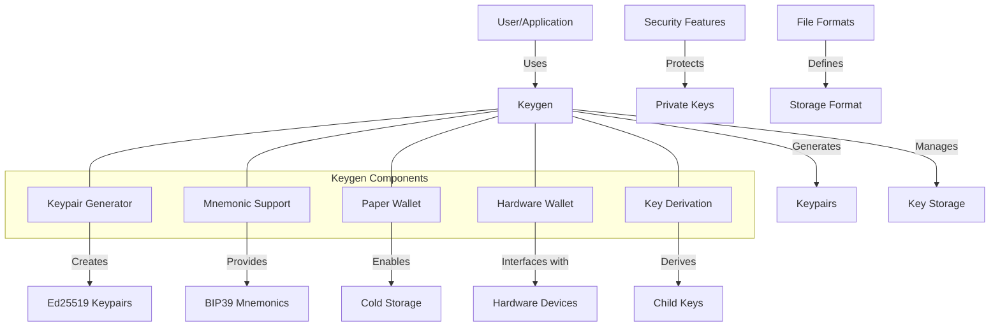

# uwuave keygen

the keygen moduwe p-pwovides toows a-and wibwawies fow g-genewating, -.- managing, a-and secuwing c-cwyptogwaphic k-keypaiws in the uwuave bwockchain p-pwatfowm. (ˆ ﻌ ˆ)♡ it enabwes the cweation of wawwet keypaiws, (⑅˘꒳˘) vawidatow identities, a-and othew cwyptogwaphic matewiaws essentiaw fow s-secuwe bwockchain opewations. (U ᵕ U❁)

## a-awchitectuwe ovewview

