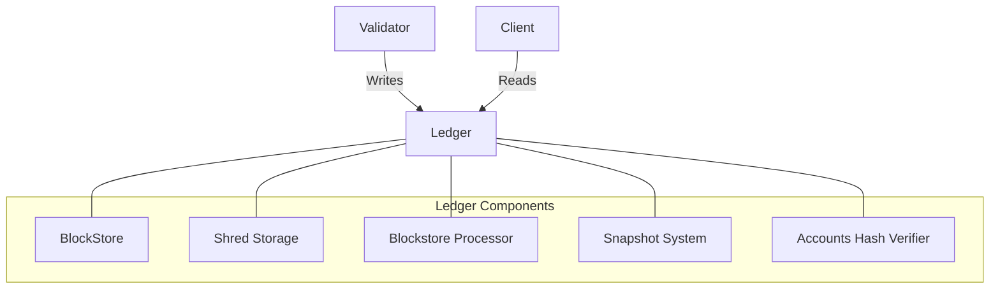

# Agave Ledger

The ledger module is responsible for storing and managing the blockchain data in the Agave platform. It provides mechanisms for persisting blocks, transactions, and account states, as well as for efficiently retrieving and validating this data.

## Architecture Overview



## Key Components

### BlockStore
The BlockStore is responsible for storing and retrieving blocks and their associated metadata. It provides an interface for accessing the blockchain data and supports various operations such as:

- Storing new blocks
- Retrieving blocks by slot or hash
- Iterating over blocks in the chain
- Checking for block existence
- Managing chain forks

### Shred Storage
Shred Storage is responsible for storing and retrieving shreds, which are fragments of blocks that are transmitted over the network. Shreds are reassembled into blocks by the BlockStore.

### Blockstore Processor
The Blockstore Processor is responsible for processing blocks and applying them to the blockchain state. It verifies blocks, executes transactions, and updates the account states.

### Snapshot System
The Snapshot System is responsible for creating and loading snapshots of the blockchain state. Snapshots are used for:

- Fast validator startup
- State synchronization
- Backup and recovery

### Accounts Hash Verifier
The Accounts Hash Verifier is responsible for verifying the integrity of the accounts database by computing and checking the accounts hash.

## Data Storage

The ledger uses a combination of storage mechanisms:

### RocksDB
RocksDB is used for storing the blockchain data, including blocks, shreds, and metadata. It provides efficient key-value storage with good performance characteristics for the ledger's access patterns.

### Append-Only Files
Append-only files are used for storing account data. This approach provides good write performance and allows for efficient snapshot creation.

### Memory-Mapped Files
Memory-mapped files are used for accessing account data, providing fast read access with minimal memory overhead.

## Performance Considerations

The ledger is designed for high performance, with several optimizations:

- **Parallelized Processing**: Many operations are parallelized to take advantage of multiple CPU cores
- **Efficient Data Structures**: Custom data structures are used to minimize memory usage and maximize throughput
- **Caching**: Frequently accessed data is cached to reduce disk I/O
- **Incremental Snapshots**: Incremental snapshots reduce the time and resources required for state synchronization
- **Compaction**: Background compaction processes optimize storage usage and query performance

## Configuration

The ledger can be configured via various parameters, including:

- **Shred Storage Type**: Controls how shreds are stored (RocksDB, memory, etc.)
- **Ledger Column Options**: Controls the configuration of individual RocksDB column families
- **Compaction Options**: Controls how and when compaction occurs
- **Snapshot Configuration**: Controls how and when snapshots are created

## Usage

### Creating a Ledger

```rust
use solana_ledger::blockstore::Blockstore;

// Open or create a ledger at the specified path
let ledger = Blockstore::open(ledger_path)?;
```

### Adding Blocks

```rust
// Add a new block to the ledger
ledger.insert_shreds(shreds, None, true)?;
```

### Retrieving Blocks

```rust
// Get a block by slot
let block = ledger.get_block(slot)?;
```

### Creating Snapshots

```rust
// Create a full snapshot
let snapshot_path = ledger.create_snapshot(slot, None, None)?;
```

## Development

### Building

To build the ledger module:

```bash
cd ledger
cargo build
```

### Testing

To run the tests for the ledger module:

```bash
cd ledger
cargo test
```

### Benchmarking

The ledger module includes benchmarks for performance-critical components:

```bash
cd ledger
cargo bench
```

## Further Reading

For more detailed information about the ledger, refer to the following resources:

- [Ledger Architecture](https://docs.anza.xyz/validator/ledger)
- [Snapshot System](https://docs.anza.xyz/validator/snapshot-system)
- [Data Persistence](https://docs.anza.xyz/validator/data-persistence)