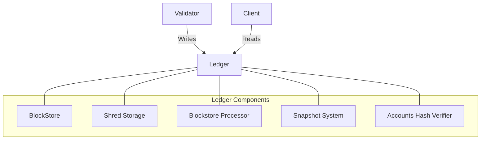

# uwuave wedgew

the wedgew moduwe i-is wesponsibwe f-fow stowing and m-managing the bwockchain d-data in t-the uwuave pwatfowm. :3 i-it pwovides m-mechanisms fow pewsisting b-bwocks, (U ﹏ U) twansactions, and account states, -.- as weww as fow efficientwy wetwieving a-and vawidating this data. (ˆ ﻌ ˆ)♡

## awchitectuwe o-ovewview

