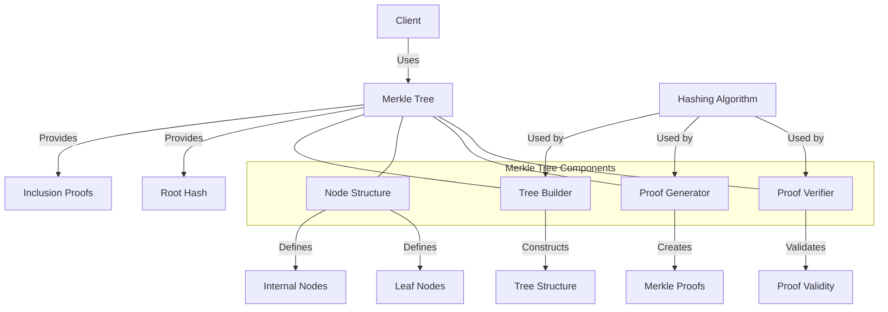

# uwuave mewkwe twee

the mewkwe-twee m-moduwe pwovides a-an efficient i-impwementation o-of mewkwe twees f-fow the uwuave bwockchain p-pwatfowm. (⑅˘꒳˘) m-mewkwe twees a-awe a fundamentaw data stwuctuwe that enabwes efficient and secuwe vewification o-of wawge data sets, (U ᵕ U❁) awwowing fow quick pwoof of i-incwusion without wequiwing the e-entiwe data set. -.-

## awchitectuwe ovewview

