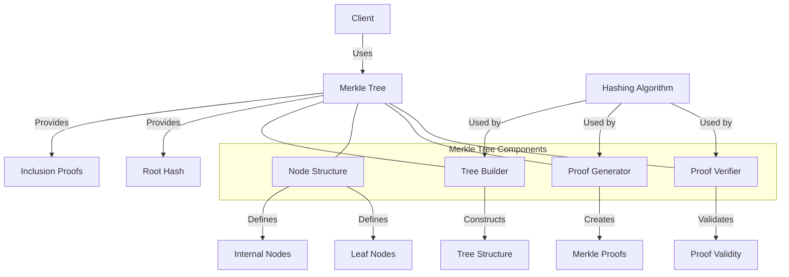

# Agave Merkle Tree

The merkle-tree module provides an efficient implementation of Merkle trees for the Agave blockchain platform. Merkle trees are a fundamental data structure that enables efficient and secure verification of large data sets, allowing for quick proof of inclusion without requiring the entire data set.

## Architecture Overview



## Key Components

### Merkle Tree
The main data structure that organizes data into a tree where:
- Each leaf node contains the hash of a data block
- Each internal node contains the hash of its child nodes
- The root node provides a single hash representing the entire data set

### Tree Builder
The Tree Builder component is responsible for:
- Constructing the Merkle tree from input data
- Computing hashes for each level of the tree
- Organizing nodes in an efficient memory layout
- Handling tree updates and modifications

### Proof Generator
The Proof Generator creates Merkle proofs that demonstrate inclusion of a specific data item in the tree:
- Identifies the path from a leaf to the root
- Collects the necessary sibling hashes along the path
- Packages the proof in a compact format

### Proof Verifier
The Proof Verifier validates Merkle proofs by:
- Recomputing the root hash using the provided proof
- Comparing the computed root hash with the known root hash
- Determining if the data item is part of the original data set

## Merkle Tree Mechanism

Merkle trees work by:

1. Hashing each data item to create leaf nodes
2. Pairing adjacent nodes and hashing them together to create parent nodes
3. Continuing this process until a single root hash is obtained
4. Using the path from a leaf to the root to create inclusion proofs

This mechanism provides:
- A single root hash that represents the entire data set
- The ability to verify data inclusion without the entire data set
- Efficient updates when data changes
- Compact proofs of inclusion

## Usage Examples

### Creating a Merkle Tree

```rust
use solana_merkle_tree::merkle_tree::MerkleTree;
use solana_sdk::hash::{Hash, Hasher};

// Create data items
let items = vec![
    "item1".as_bytes(),
    "item2".as_bytes(),
    "item3".as_bytes(),
    "item4".as_bytes(),
];

// Hash the items
let hashed_items: Vec<Hash> = items
    .iter()
    .map(|item| {
        let mut hasher = Hasher::default();
        hasher.hash(item);
        hasher.result()
    })
    .collect();

// Create a Merkle tree
let merkle_tree = MerkleTree::new(&hashed_items);

// Get the root hash
let root_hash = merkle_tree.get_root();
println!("Root hash: {:?}", root_hash);
```

### Generating a Merkle Proof

```rust
use solana_merkle_tree::merkle_tree::MerkleTree;
use solana_sdk::hash::{Hash, Hasher};

// Create a Merkle tree with some data
let hashed_items = /* hash your data items */;
let merkle_tree = MerkleTree::new(&hashed_items);

// Generate a proof for the item at index 2
let proof = merkle_tree.get_proof(2);
println!("Proof for item at index 2: {:?}", proof);
```

### Verifying a Merkle Proof

```rust
use solana_merkle_tree::merkle_tree::{MerkleTree, verify_proof};
use solana_sdk::hash::{Hash, Hasher};

// Create a Merkle tree and generate a proof
let hashed_items = /* hash your data items */;
let merkle_tree = MerkleTree::new(&hashed_items);
let proof = merkle_tree.get_proof(2);
let root_hash = merkle_tree.get_root();

// Item to verify
let item_hash = hashed_items[2];

// Verify the proof
let is_valid = verify_proof(&proof, root_hash, item_hash);
assert!(is_valid, "Proof verification failed");
```

### Creating a Sparse Merkle Tree

```rust
use solana_merkle_tree::sparse_merkle_tree::SparseMerkleTree;
use solana_sdk::hash::{Hash, Hasher};

// Create a sparse Merkle tree
let mut sparse_tree = SparseMerkleTree::new();

// Insert key-value pairs
sparse_tree.insert("key1".as_bytes(), "value1".as_bytes());
sparse_tree.insert("key2".as_bytes(), "value2".as_bytes());
sparse_tree.insert("key3".as_bytes(), "value3".as_bytes());

// Get the root hash
let root_hash = sparse_tree.get_root();

// Generate a proof for a key
let proof = sparse_tree.get_proof("key2".as_bytes());

// Verify the proof
let is_valid = sparse_tree.verify_proof(
    &proof,
    "key2".as_bytes(),
    "value2".as_bytes()
);
assert!(is_valid, "Proof verification failed");
```

## Performance Considerations

The Merkle tree implementation is optimized for performance:

- **Efficient Memory Layout**: Uses a compact representation to minimize memory usage
- **Optimized Hashing**: Implements efficient hashing algorithms
- **Parallel Processing**: Supports parallel computation of hashes where applicable
- **Incremental Updates**: Allows efficient updates without rebuilding the entire tree
- **Proof Compression**: Minimizes the size of inclusion proofs

Performance characteristics:

- Tree construction is O(n) where n is the number of data items
- Proof generation is O(log n) where n is the number of data items
- Proof verification is O(log n) where n is the number of data items
- Memory usage is O(n) for the tree and O(log n) for proofs

## Applications in Agave

Merkle trees are used throughout the Agave blockchain for:

- **Account State Verification**: Efficiently proving the state of accounts
- **Transaction Verification**: Verifying that transactions are included in blocks
- **Block Validation**: Validating the contents of blocks
- **State Synchronization**: Efficiently synchronizing state between nodes
- **Light Client Support**: Enabling lightweight verification without full data

## Development

### Building

To build the merkle-tree module:

```bash
cd merkle-tree
cargo build
```

### Testing

To run the tests for the merkle-tree module:

```bash
cd merkle-tree
cargo test
```

## Further Reading

For more detailed information about Merkle trees and their applications, refer to the following resources:

- [Merkle Tree Fundamentals](https://en.wikipedia.org/wiki/Merkle_tree)
- [Data Structures in Agave](https://docs.anza.xyz/developing/data-structures/overview)
- [State Verification in Agave](https://docs.anza.xyz/validator/state-verification)
- [Light Client Implementation](https://docs.anza.xyz/developing/clients/light-clients)