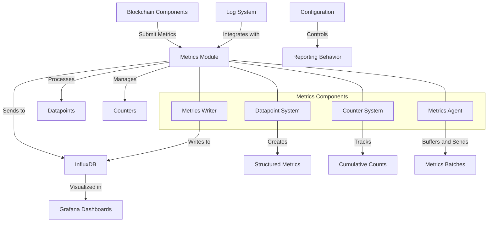

# Agave Metrics

The metrics module is a critical component of the Agave blockchain platform, responsible for collecting, processing, and reporting performance and operational metrics. It provides a comprehensive framework for monitoring the health and performance of validators, clusters, and other blockchain components through integration with InfluxDB and Grafana.

## Architecture Overview



## Key Components

### Datapoint System
The Datapoint System provides a structured way to create and submit metrics:
- **DataPoint**: Core structure representing a single metric point with name, timestamp, tags, and fields
- **Macros**: Helper macros like `datapoint_info!`, `datapoint_error!` for easy metric submission
- **Field Types**: Support for various field types (bool, i64, f64, String)
- **Tagging**: Ability to add tags for grouping and filtering metrics

### Counter System
The Counter System enables efficient tracking of cumulative metrics:
- **Counter**: Structure for tracking counts and submission rates
- **CounterPoint**: Representation of a counter's state at a point in time
- **Macros**: Helper macros like `inc_new_counter_info!` for incrementing counters
- **Rate Limiting**: Configurable logging and metrics submission rates

### Metrics Agent
The Metrics Agent manages the collection and submission of metrics:
- **Buffering**: Collects metrics in memory before sending
- **Batching**: Groups metrics for efficient transmission
- **Rate Limiting**: Prevents excessive metrics submission
- **Background Processing**: Handles metrics in a dedicated thread

### Metrics Writer
The Metrics Writer handles the actual transmission of metrics:
- **InfluxDB Integration**: Formats and sends metrics to InfluxDB
- **Error Handling**: Manages connection and transmission errors
- **Serialization**: Efficiently formats metrics for the wire protocol

## Usage Examples

### Submitting a Simple Datapoint

```rust
use solana_metrics::{datapoint_info, datapoint_error};

// Submit an informational datapoint with various field types
datapoint_info!(
    "process_transaction",
    ("slot", 1234, i64),
    ("success", true, bool),
    ("duration_us", 235.0, f64),
    ("transaction_type", "transfer", String)
);

// Submit an error datapoint
datapoint_error!(
    "transaction_error",
    ("error_code", 23, i64),
    ("slot", 1234, i64)
);
```

### Using Counters for Cumulative Metrics

```rust
use solana_metrics::{inc_new_counter_info, inc_new_counter_error};

// Increment a counter with default settings
inc_new_counter_info!("processed_transactions", 1);

// Increment a counter with custom log rate (log every 100 increments)
inc_new_counter_info!("successful_transactions", 1, 100);

// Increment a counter with custom log and metrics rates
inc_new_counter_info!("vote_transactions", 1, 100, 1000);

// Increment an error counter
inc_new_counter_error!("failed_transactions", 1);
```

### Adding Tags for Grouping

```rust
use solana_metrics::datapoint_info;

// Submit a datapoint with tags for grouping in queries
datapoint_info!(
    "validator_status",
    "validator_id" => "validator1",
    "region" => "us-west",
    ("slot", 1234, i64),
    ("vote_credits", 4567, i64),
    ("is_leader", true, bool)
);
```

### Using the Panic Hook

```rust
use solana_metrics::set_panic_hook;

// Set a panic hook to report panics as metrics
set_panic_hook("validator", Some("1.14.0".to_string()));
```

### Manual Metrics Submission

```rust
use solana_metrics::{submit, datapoint::DataPoint};
use log::Level;

// Create a datapoint manually
let mut point = DataPoint::new("custom_metric");
point.add_field_i64("value", 100);
point.add_tag("component", "validator");

// Submit the datapoint
submit(point, Level::Info);
```

## Configuration

The metrics module can be configured through environment variables:

- **SOLANA_METRICS_CONFIG**: Main configuration string in the format `host=<host>,db=<db>,u=<username>,p=<password>`
- **SOLANA_DEFAULT_METRICS_RATE**: Default rate (in milliseconds) for submitting metrics (default: 1000)
- **SOLANA_DEFAULT_LOG_RATE**: Default rate for logging counter values (default: 1000)
- **SOLANA_METRICS_MAX_POINTS_PER_SECOND**: Maximum number of points to submit per second (default: 4000)

Example configuration:

```bash
export SOLANA_METRICS_CONFIG="host=https://metrics.solana.com:8086,db=mainnet-beta,u=username,p=password"
export SOLANA_DEFAULT_METRICS_RATE=2000
export SOLANA_DEFAULT_LOG_RATE=500
export SOLANA_METRICS_MAX_POINTS_PER_SECOND=5000
```

## Monitoring Infrastructure

### InfluxDB

The metrics module sends data to InfluxDB, a time-series database optimized for metrics storage. There are several environments available:

- **Production**: https://metrics.solana.com:8888/
- **Testing**: https://metrics.solana.com:8889/
- **Local Cluster**: https://internal-metrics.solana.com:8888/

### Grafana Dashboards

Metrics can be visualized through Grafana dashboards:

- **Cluster Telemetry**: https://metrics.solana.com/d/monitor-edge/cluster-telemetry
- **Fee Market**: https://metrics.solana.com/d/0n54roOVz/fee-market
- **Ping Results**: https://metrics.solana.com/d/UpIWbId4k/ping-result
- **Local Cluster**: https://internal-metrics.solana.com:3000/

### Dashboard Components

The Cluster Telemetry dashboard includes:

1. **Cluster Stability**: Overall health and stability metrics
2. **Validator Streamer**: Metrics related to validator streaming performance
3. **Tower Consensus**: Consensus-related metrics
4. **IP Network**: Network performance and connectivity metrics
5. **Snapshots**: Snapshot creation and loading metrics
6. **RPC Send Transaction Service**: Metrics for the transaction submission service

## Local Development

### Running Local Monitoring

The `scripts` directory contains tools for setting up a local monitoring environment:

```bash
cd metrics/scripts
./start.sh  # Start local InfluxDB and Grafana
./status.sh  # Check status of monitoring services
./stop.sh   # Stop monitoring services
```

### Testing Metrics Submission

```bash
# Set up local configuration
export SOLANA_METRICS_CONFIG="host=http://localhost:8086,db=testnet,u=admin,p=admin"

# Run a test that submits metrics
cd metrics
cargo test --package solana-metrics -- --nocapture
```

## Development

### Building

To build the metrics module:

```bash
cd metrics
cargo build
```

### Testing

To run the tests for the metrics module:

```bash
cd metrics
cargo test
```

### Benchmarking

To run benchmarks for the metrics module:

```bash
cd metrics
cargo bench
```

## Further Reading

For more detailed information about metrics and monitoring, refer to the following resources:

- [Validator Monitoring Guide](https://docs.anza.xyz/running-validator/validator-monitor)
- [Metrics Dashboard Guide](https://docs.anza.xyz/validator/metrics-dashboards)
- [InfluxDB Documentation](https://docs.influxdata.com/)
- [Grafana Documentation](https://grafana.com/docs/)