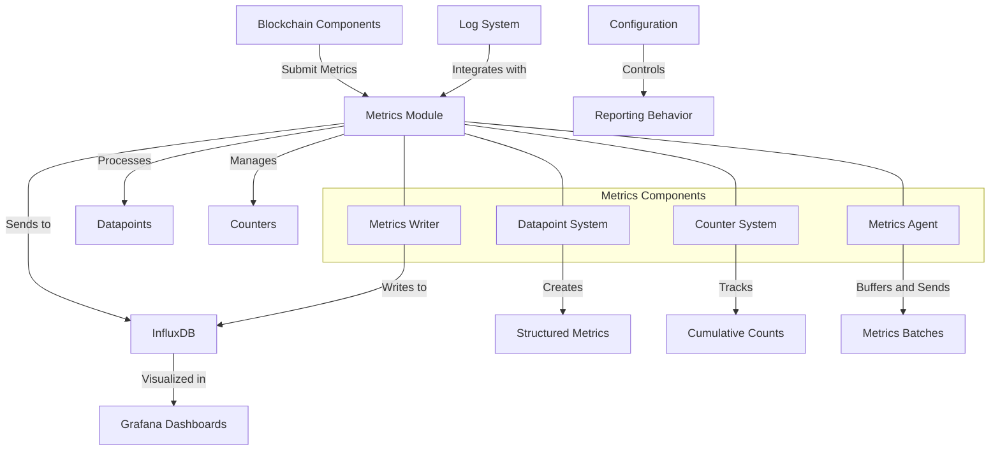

# uwuave metwics

the metwics moduwe i-is a cwiticaw c-component of the uwuave bwockchain p-pwatfowm, ^^;; wesponsibwe f-fow cowwecting, >_< p-pwocessing, mya a-and wepowting p-pewfowmance and opewationaw metwics. mya it pwovides a compwehensive fwamewowk fow m-monitowing the heawth and pewfowmance of vawidatows, 😳 c-cwustews, XD and othew bwockchain c-components thwough integwation with infwuxdb and gwafana. :3

## a-awchitectuwe ovewview

