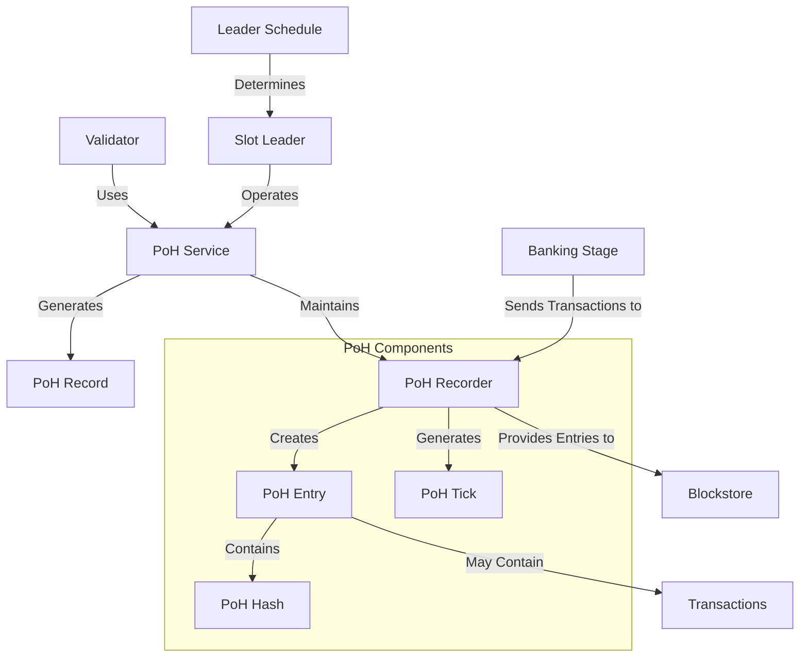

# Agave Proof of History (PoH)

The poh module is a fundamental component of the Agave blockchain platform, implementing the Proof of History consensus mechanism. PoH provides a cryptographic time source that enables validators to agree on the order of events without requiring explicit coordination, significantly improving the efficiency and scalability of the blockchain.

## Architecture Overview



## Key Components

### PoH Service
The PoH Service is the main component that manages the PoH generation process. It coordinates the creation of PoH records and ensures they are properly maintained and distributed.

### PoH Recorder
The PoH Recorder is responsible for recording transactions into the PoH stream. It:
- Maintains the current PoH state
- Processes incoming transactions
- Creates entries that include transactions
- Generates ticks when no transactions are available

### PoH Entry
A PoH Entry represents a point in the PoH sequence. It contains:
- A PoH hash that serves as a timestamp
- Zero or more transactions that occurred at that time
- Metadata about the entry

### PoH Hash
The PoH Hash is a cryptographic hash that serves as a verifiable timestamp. It is created by repeatedly applying a hash function to its previous output, creating a sequence that can only be produced by sequential computation.

### PoH Tick
A PoH Tick is a special type of entry that contains no transactions. It is generated at regular intervals to maintain the PoH sequence even when there are no transactions to process.

## How PoH Works

Proof of History works by creating a sequential hash chain that serves as a cryptographic clock:

1. **Initialization**: Start with a known hash value
2. **Sequential Hashing**: Repeatedly apply a hash function to its own output
3. **Transaction Inclusion**: When transactions arrive, include their hash in the sequence
4. **Tick Generation**: Generate empty ticks at regular intervals to maintain timing
5. **Entry Creation**: Combine transactions and the current PoH hash to create entries
6. **Verification**: Other validators can verify the sequence by recomputing the hashes

This approach provides a verifiable passage of time without requiring trust between nodes, enabling efficient consensus.

## Usage Examples

### Creating a PoH Recorder

```rust
use solana_poh::poh_recorder::{PohRecorder, Record};
use solana_runtime::bank::Bank;
use std::sync::{Arc, Mutex};

// Create a PoH recorder
let tick_height = 0;
let bank = Arc::new(Bank::default());
let previous_bank_hash = bank.hash();
let leader_schedule = Arc::new(LeaderSchedule::default());

let poh_recorder = PohRecorder::new(
    tick_height,
    previous_bank_hash,
    bank.clone(),
    None,
    bank.ticks_per_slot(),
    &leader_schedule,
    &bank.id(),
    None,
    &Arc::new(Mutex::new(Record::default())),
    &Arc::new(PohConfig::default()),
);
```

### Recording Transactions

```rust
use solana_poh::poh_recorder::PohRecorder;
use solana_sdk::transaction::Transaction;

// Record a batch of transactions
let transactions: Vec<Transaction> = /* get transactions */;
let bank_slot = poh_recorder.bank().unwrap().slot();

poh_recorder.record(
    bank_slot,
    transactions.iter(),
    /* some other parameters */,
);
```

### Generating Ticks

```rust
use solana_poh::poh_service::PohService;
use std::sync::mpsc::channel;

// Create channels for communication
let (poh_entry_sender, poh_entry_receiver) = channel();
let (ticks_sender, ticks_receiver) = channel();

// Start the PoH service
let poh_service = PohService::new(
    poh_recorder,
    &poh_config,
    poh_entry_sender,
    Some(ticks_sender),
    leader_schedule,
);

// Receive generated ticks
while let Ok(tick) = ticks_receiver.recv() {
    // Process the tick
}
```

## Performance Considerations

The PoH module is designed for high performance:

- **Efficient Hashing**: Uses optimized hash functions for fast sequential hashing
- **Parallel Transaction Processing**: Processes transactions in parallel while maintaining sequential PoH
- **Batched Entry Creation**: Groups transactions into batches for efficient entry creation
- **Optimized Verification**: Enables efficient verification of the PoH sequence
- **Configurable Parameters**: Allows tuning of parameters for different performance requirements

## Configuration

The PoH module can be configured with various parameters:

- **Hashing Algorithm**: The cryptographic hash function used for PoH
- **Tick Rate**: How frequently ticks are generated
- **Ticks Per Slot**: The number of ticks in each slot
- **Target Tick Duration**: The target duration of each tick
- **Hashes Per Tick**: The number of hash operations per tick

## Development

### Building

To build the poh module:

```bash
cd poh
cargo build
```

### Testing

To run the tests for the poh module:

```bash
cd poh
cargo test
```

## Further Reading

For more detailed information about Proof of History, refer to the following resources:

- [Proof of History: A Clock for Blockchain](https://docs.anza.xyz/implemented-proposals/poh)
- [Consensus Mechanism](https://docs.anza.xyz/validator/consensus)
- [Leader Schedule](https://docs.anza.xyz/validator/leader-schedule)
- [Transaction Processing](https://docs.anza.xyz/validator/transaction-processing)