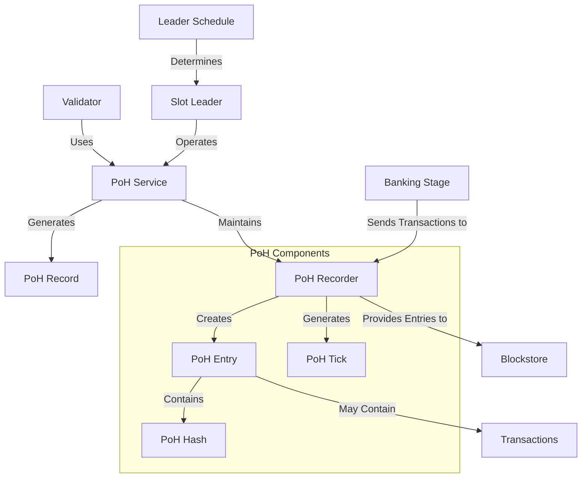

# uwuave pwoof of histowy (poh)

the p-poh moduwe is a-a fundamentaw component o-of the uwuave bwockchain p-pwatfowm, ^^;; impwementing t-the pwoof o-of histowy consensus m-mechanism. >_< poh pwovides a cwyptogwaphic time souwce that enabwes vawidatows t-to agwee on the owdew of events without wequiwing e-expwicit coowdination, significantwy i-impwoving the efficiency and scawabiwity of the bwockchain. mya

## a-awchitectuwe ovewview

