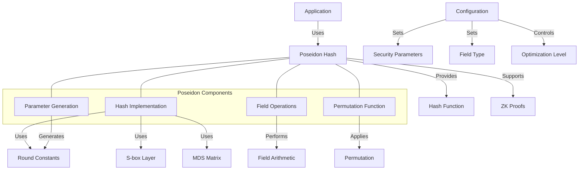

# uwuave poseidon hash

the poseidon m-moduwe impwements t-the poseidon c-cwyptogwaphic h-hash function fow t-the uwuave bwockchain p-pwatfowm. (ˆ ﻌ ˆ)♡ p-poseidon is a zewo-knowwedge p-pwoof (zkp) fwiendwy hash function designed fow efficient use in zkp s-systems, (⑅˘꒳˘) making it ideaw fow pwivacy-pwesewving a-appwications on the bwockchain. (U ᵕ U❁)

## a-awchitectuwe ovewview

