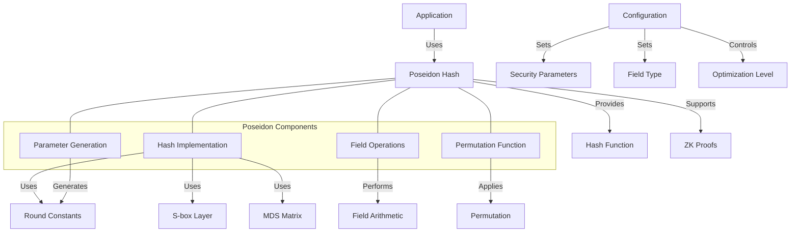

# Agave Poseidon Hash

The poseidon module implements the Poseidon cryptographic hash function for the Agave blockchain platform. Poseidon is a zero-knowledge proof (ZKP) friendly hash function designed for efficient use in ZKP systems, making it ideal for privacy-preserving applications on the blockchain.

## Architecture Overview



## Key Components

### Hash Implementation
The Hash Implementation is the core component that provides the Poseidon hash function:
- Processes input data in chunks
- Applies the Poseidon permutation
- Produces fixed-length hash outputs
- Supports different field types and security parameters

### Parameter Generation
The Parameter Generation component creates the cryptographic parameters needed for the hash function:
- Round constants for each round
- MDS (Maximum Distance Separable) matrix
- S-box parameters
- Security parameters based on the desired security level

### Field Operations
The Field Operations component handles arithmetic in finite fields:
- Addition, subtraction, multiplication, and inversion
- Optimized implementations for different field types
- Constant-time operations for security
- Support for various field sizes

### Permutation Function
The Permutation Function applies the core cryptographic transformation:
- Substitution layer (S-box)
- Linear diffusion layer (MDS matrix multiplication)
- Addition of round constants
- Full and partial rounds for efficiency

## Poseidon Hash Mechanism

The Poseidon hash function works through the following steps:

1. **Initialization**: Set up the initial state with the input data
2. **Permutation**: Apply the Poseidon permutation function
   - Full rounds: Apply S-box to all state elements
   - Partial rounds: Apply S-box to a single state element
   - Linear diffusion: Apply MDS matrix multiplication
   - Add round constants
3. **Finalization**: Extract the hash result from the final state

This mechanism provides:
- Cryptographic security against preimage and collision attacks
- Efficiency in ZKP systems
- Flexibility for different security levels and field types
- Compatibility with various ZKP frameworks

## Usage Examples

### Basic Hashing

```rust
use solana_poseidon::poseidon::{Poseidon, PoseidonParams};
use solana_poseidon::field::Field;

// Create Poseidon parameters for the desired field and security level
let params = PoseidonParams::<Field>::new(
    2,      // Width (number of field elements in the state)
    8,      // Full rounds
    57,     // Partial rounds
);

// Create a Poseidon hasher
let mut poseidon = Poseidon::new(&params);

// Hash some data
let input = [Field::from(123), Field::from(456)];
let hash = poseidon.hash(&input);

println!("Poseidon hash: {:?}", hash);
```

### Incremental Hashing

```rust
use solana_poseidon::poseidon::{Poseidon, PoseidonParams};
use solana_poseidon::field::Field;

// Create Poseidon parameters
let params = PoseidonParams::<Field>::new(
    3,      // Width
    8,      // Full rounds
    57,     // Partial rounds
);

// Create a Poseidon hasher
let mut poseidon = Poseidon::new(&params);

// Update the hasher with data incrementally
poseidon.update(&[Field::from(123)]);
poseidon.update(&[Field::from(456), Field::from(789)]);

// Finalize and get the hash
let hash = poseidon.finalize();

println!("Incremental Poseidon hash: {:?}", hash);
```

### Using with Different Field Types

```rust
use solana_poseidon::poseidon::{Poseidon, PoseidonParams};
use solana_poseidon::field::{Bn254Field, AltBn128Field};

// Using with BN254 field
let bn254_params = PoseidonParams::<Bn254Field>::new(
    2,      // Width
    8,      // Full rounds
    57,     // Partial rounds
);
let mut bn254_poseidon = Poseidon::new(&bn254_params);
let bn254_input = [Bn254Field::from(123), Bn254Field::from(456)];
let bn254_hash = bn254_poseidon.hash(&bn254_input);

// Using with AltBN128 field
let altbn128_params = PoseidonParams::<AltBn128Field>::new(
    2,      // Width
    8,      // Full rounds
    57,     // Partial rounds
);
let mut altbn128_poseidon = Poseidon::new(&altbn128_params);
let altbn128_input = [AltBn128Field::from(123), AltBn128Field::from(456)];
let altbn128_hash = altbn128_poseidon.hash(&altbn128_input);
```

### Creating a Merkle Tree with Poseidon

```rust
use solana_poseidon::poseidon::{Poseidon, PoseidonParams};
use solana_poseidon::field::Field;
use solana_poseidon::merkle::{MerkleTree, MerkleProof};

// Create Poseidon parameters
let params = PoseidonParams::<Field>::new(
    2,      // Width
    8,      // Full rounds
    57,     // Partial rounds
);

// Create a Poseidon hasher
let poseidon = Poseidon::new(&params);

// Create a Merkle tree with Poseidon hash
let leaves = vec![
    Field::from(1),
    Field::from(2),
    Field::from(3),
    Field::from(4),
];
let merkle_tree = MerkleTree::new(&leaves, poseidon);

// Get the root hash
let root = merkle_tree.root();

// Generate a proof for a leaf
let proof = merkle_tree.generate_proof(2); // Proof for the third leaf (index 2)

// Verify the proof
let is_valid = proof.verify(root, Field::from(3));
assert!(is_valid, "Merkle proof verification failed");
```

## Performance Considerations

The Poseidon hash function is optimized for use in zero-knowledge proof systems:

- **ZKP Efficiency**: Minimizes the number of non-linear operations (S-box applications)
- **Field-Specific Optimizations**: Implements optimized arithmetic for different field types
- **Round Optimization**: Uses a combination of full and partial rounds for better performance
- **Constant-Time Operations**: Implements operations in constant time to prevent timing attacks
- **SIMD Support**: Utilizes SIMD instructions where available for parallel computation

Performance characteristics:

- Poseidon is significantly faster than SHA-256 in ZKP circuits
- The performance varies based on the field type and security parameters
- Partial rounds improve performance with minimal security impact
- The MDS matrix multiplication is the most computationally intensive operation

## Applications in Agave

Poseidon hash is used in various privacy-preserving features of the Agave blockchain:

- **Zero-Knowledge Proofs**: Enables efficient ZKP generation and verification
- **Private Transactions**: Supports confidential transaction schemes
- **Anonymous Credentials**: Enables anonymous authentication
- **Merkle Trees**: Provides efficient Merkle tree implementations for ZKP systems
- **Commitment Schemes**: Enables efficient cryptographic commitments

## Development

### Building

To build the poseidon module:

```bash
cd poseidon
cargo build
```

### Testing

To run the tests for the poseidon module:

```bash
cd poseidon
cargo test
```

### Benchmarking

To run benchmarks for the poseidon module:

```bash
cd poseidon
cargo bench
```

## Further Reading

For more detailed information about Poseidon hash and its applications, refer to the following resources:

- [Poseidon Paper](https://eprint.iacr.org/2019/458.pdf)
- [Zero-Knowledge Proofs in Agave](https://docs.anza.xyz/developing/zk-token-sdk/overview)
- [Privacy Features in Agave](https://docs.anza.xyz/developing/privacy-features)
- [Cryptographic Primitives](https://docs.anza.xyz/developing/cryptography/primitives)