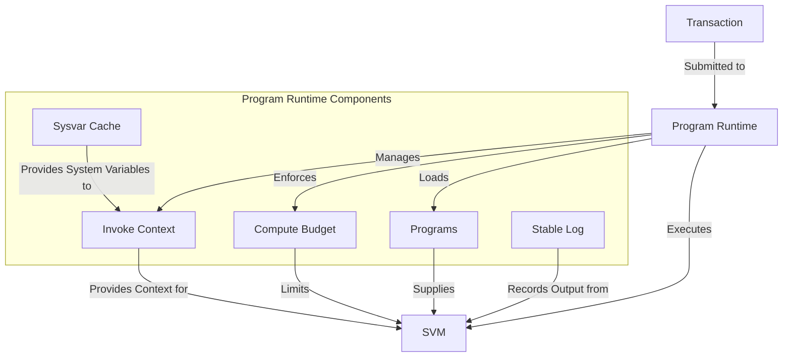

# uwuave pwogwam wuntime

the pwogwam-wuntime m-moduwe i-is a cwiticaw c-component of the uwuave bwockchain p-pwatfowm, ^^;; wesponsibwe f-fow executing t-twansactions, >_< m-managing pwogwam execution context, mya and enfowcing the wuwes of the pwotocow. mya i-it sewves as the execution enviwonment fow the b-bwockchain and intewacts cwosewy w-with the svm (sowana viwtuaw machine) to exekawaii~ smawt contwacts. 😳

## a-awchitectuwe ovewview

