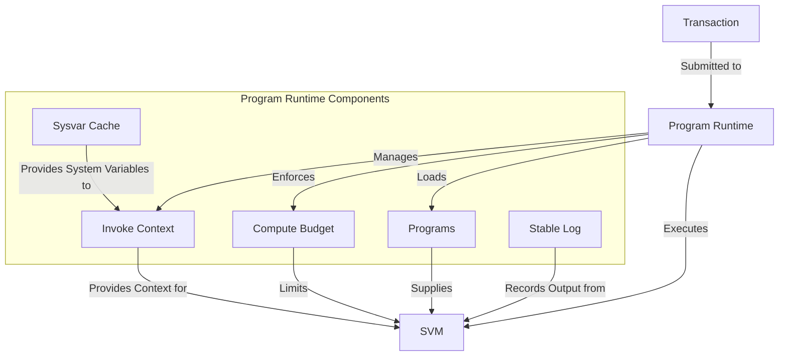

# Agave Program Runtime

The program-runtime module is a critical component of the Agave blockchain platform, responsible for executing transactions, managing program execution context, and enforcing the rules of the protocol. It serves as the execution environment for the blockchain and interacts closely with the SVM (Solana Virtual Machine) to execute smart contracts.

## Architecture Overview



## Key Components

### Invoke Context
The Invoke Context is the main pipeline from runtime to program execution. It manages the execution context for instructions, including:
- Transaction context
- Program cache
- Compute budget and metering
- Logging
- Environment configuration

It handles cross-program invocations, signature verification, account access control, and compute unit consumption tracking.

### Loaded Programs
The Loaded Programs component manages the cache of loaded, verified, and compiled programs. It includes:
- Program cache for storing compiled programs
- Program loading and verification
- Program eviction strategies
- Fork-aware program versioning

This component optimizes program loading by caching frequently used programs and managing their lifecycle based on usage patterns.

### Sysvar Cache
The Sysvar Cache provides efficient access to system variables such as:
- Clock (current network time)
- Rent (rent calculation constants)
- Epoch Schedule (information about epoch timing)
- Fees (current fee schedule)

### Stable Log
The Stable Log component handles logging during program execution, providing a consistent interface for programs to emit log messages.

### Memory Pool
The Memory Pool manages memory allocation for program execution, ensuring efficient memory usage and preventing memory-related security issues.

## Program Execution Flow

1. **Transaction Submission**: A transaction containing one or more instructions is submitted to the network
2. **Instruction Processing**: Each instruction is processed sequentially
3. **Program Loading**: The program specified by the instruction is loaded from the program cache or from the account data
4. **Execution Environment Setup**: An invoke context is created with the necessary parameters
5. **Compute Budget Allocation**: Compute units are allocated based on the compute budget
6. **Program Execution**: The program is executed within the SVM
7. **State Updates**: Account states are updated based on the execution results
8. **Result Reporting**: Execution results are reported back to the caller

## Usage Examples

### Creating an Invoke Context

```rust
use solana_program_runtime::{
    invoke_context::{InvokeContext, EnvironmentConfig},
    loaded_programs::ProgramCacheForTxBatch,
};

// Create an invoke context for transaction execution
let invoke_context = InvokeContext::new(
    transaction_context,
    program_cache_for_tx_batch,
    environment_config,
    log_collector,
    compute_budget,
);
```

### Processing an Instruction

```rust
use solana_program_runtime::invoke_context::InvokeContext;

// Process an instruction
let mut compute_units_consumed = 0;
invoke_context.process_instruction(
    instruction_data,
    instruction_accounts,
    program_indices,
    &mut compute_units_consumed,
    &mut timings,
)?;
```

### Managing Program Cache

```rust
use solana_program_runtime::loaded_programs::{ProgramCache, ProgramCacheForTxBatch};

// Create a program cache for a transaction batch
let mut program_cache_for_tx_batch = ProgramCacheForTxBatch::new(
    slot,
    environments,
    upcoming_environments,
    latest_root_epoch,
);

// Find a program in the cache
if let Some(program) = program_cache_for_tx_batch.find(&program_id) {
    // Use the program
}
```

## Configuration

The program-runtime module can be configured with various parameters:

- **Compute Budget**: Controls the maximum number of compute units available for transaction execution
- **Program Cache Size**: Controls the number of programs that can be cached in memory
- **Log Level**: Controls the verbosity of logging
- **Feature Flags**: Controls the activation of various features

## Development

### Building

To build the program-runtime module:

```bash
cd program-runtime
cargo build
```

### Testing

To run the tests for the program-runtime module:

```bash
cd program-runtime
cargo test
```

## Further Reading

For more detailed information about the program runtime, refer to the following resources:

- [Transaction Processing](https://docs.anza.xyz/validator/transaction-processing)
- [Program Execution](https://docs.anza.xyz/validator/program-execution)
- [Compute Budget](https://docs.anza.xyz/developing/programming-model/runtime)
- [Cross-Program Invocation](https://docs.anza.xyz/developing/programming-model/calling-between-programs)