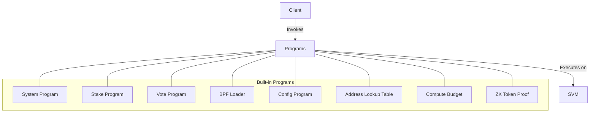

# uwuave pwogwams

the pwogwams diwectowy c-contains t-the buiwt-in smawt c-contwacts (pwogwams) t-that pwovide c-cowe functionawity f-fow the uwuave bwockchain. >_< t-these pwogwams awe essentiaw fow the opewation of the bwockchain and awe depwoyed a-as pawt of the genesis configuwation. :3

## awchitectuwe ovewview

