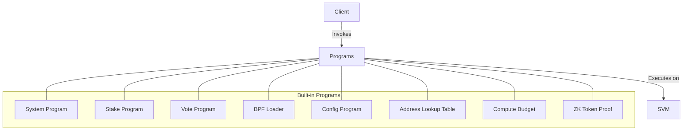

# Agave Programs

The programs directory contains the built-in smart contracts (programs) that provide core functionality for the Agave blockchain. These programs are essential for the operation of the blockchain and are deployed as part of the genesis configuration.

## Architecture Overview



## Core Programs

### System Program
The System Program is responsible for creating new accounts, allocating account space, transferring SOL, and assigning accounts to programs. It is the most fundamental program in the Agave ecosystem.

**Key Functions:**
- Create new accounts
- Allocate account space
- Transfer SOL between accounts
- Assign accounts to programs

### Stake Program
The Stake Program manages the staking mechanism, which is a key component of the Proof of Stake consensus. It allows token holders to delegate their stake to validators, who use it to vote on the validity of blocks.

**Key Functions:**
- Create stake accounts
- Delegate stake to validators
- Withdraw stake
- Split and merge stake accounts

### Vote Program
The Vote Program manages validator voting, which is essential for the consensus mechanism. Validators use it to cast votes on the validity of blocks, which are then used to determine the canonical chain.

**Key Functions:**
- Create vote accounts
- Cast votes
- Withdraw voting rewards
- Update validator identity

### BPF Loader
The BPF Loader is responsible for loading and executing BPF (Berkeley Packet Filter) programs. It is the primary program loader in the Agave ecosystem and is used to deploy and execute smart contracts.

**Key Functions:**
- Deploy programs
- Execute program instructions
- Upgrade programs

### Config Program
The Config Program provides a way to store configuration data on-chain. It is used for various system configurations, such as validator registration and feature activation.

**Key Functions:**
- Store configuration data
- Update configuration data
- Access configuration data

### Address Lookup Table
The Address Lookup Table program allows for the creation and management of lookup tables that can be used to compress transaction size by referencing accounts by a short index rather than their full public key.

**Key Functions:**
- Create lookup tables
- Add addresses to lookup tables
- Use lookup tables in transactions

### Compute Budget
The Compute Budget program allows transactions to specify their compute budget, which determines how much compute resources they can use during execution.

**Key Functions:**
- Set compute unit limit
- Set compute unit price
- Request heap memory

### ZK Token Proof
The ZK Token Proof program provides zero-knowledge proof verification for confidential token transfers, enabling privacy-preserving transactions.

**Key Functions:**
- Verify zero-knowledge proofs
- Enable confidential transfers
- Support privacy-preserving operations

## Program Development

### Program Structure
Agave programs typically follow a common structure:

- **Entrypoint**: The entry function that is called when the program is invoked
- **Instruction Processing**: Logic to parse and process different instructions
- **State Management**: Logic to manage program state stored in accounts
- **Error Handling**: Mechanisms to handle and report errors

### Program Deployment
Built-in programs are deployed as part of the genesis configuration and are available at well-known addresses. Custom programs can be deployed using the BPF Loader program.

### Program Invocation
Programs are invoked by including them in transaction instructions. Each instruction specifies:

- The program to invoke (via its address)
- The accounts the program can access
- The instruction data, which tells the program what operation to perform

### Cross-Program Invocation (CPI)
Programs can invoke other programs using Cross-Program Invocation (CPI), which allows for composability and reuse of functionality.

## Testing

The programs directory includes various test suites for the built-in programs:

- **Unit Tests**: Test individual functions and components
- **Integration Tests**: Test program behavior in a simulated environment
- **Conformance Tests**: Ensure programs adhere to their specifications

To run the tests:

```bash
cd programs
cargo test
```

## Further Reading

For more detailed information about the built-in programs, refer to the following resources:

- [System Program](https://docs.anza.xyz/developing/runtime-facilities/programs#system-program)
- [Stake Program](https://docs.anza.xyz/developing/runtime-facilities/programs#stake-program)
- [Vote Program](https://docs.anza.xyz/developing/runtime-facilities/programs#vote-program)
- [BPF Loader](https://docs.anza.xyz/developing/runtime-facilities/programs#bpf-loader)
- [Program Development Guide](https://docs.anza.xyz/developing/on-chain-programs/overview)