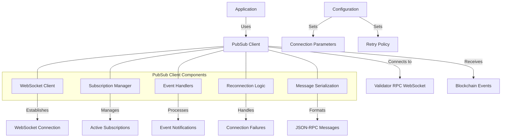

# Agave PubSub Client

The pubsub-client module provides a WebSocket-based publish-subscribe client for the Agave blockchain platform. It enables applications to subscribe to real-time blockchain events such as account updates, transaction confirmations, and slot changes, allowing for responsive and event-driven application development.

## Architecture Overview



## Key Components

### WebSocket Client
The WebSocket Client component manages the WebSocket connection to the validator's RPC endpoint:
- Establishes and maintains WebSocket connections
- Handles connection lifecycle events (open, close, error)
- Sends subscription requests and receives event notifications
- Implements protocol-specific handling for JSON-RPC over WebSockets

### Subscription Manager
The Subscription Manager component handles subscription lifecycle:
- Creates and tracks active subscriptions
- Manages subscription IDs and callbacks
- Handles subscription renewal after reconnection
- Provides methods for unsubscribing from events

### Event Handlers
The Event Handlers component processes incoming event notifications:
- Parses event data into appropriate types
- Routes events to the correct subscription callbacks
- Handles different event types (account updates, transactions, slots, etc.)
- Provides type-safe interfaces for event data

### Reconnection Logic
The Reconnection Logic component handles connection failures:
- Implements exponential backoff for reconnection attempts
- Restores subscriptions after successful reconnection
- Provides configurable retry policies
- Handles graceful degradation during extended outages

### Message Serialization
The Message Serialization component handles JSON-RPC message formatting:
- Serializes subscription requests
- Deserializes event notifications
- Handles JSON-RPC protocol specifics
- Provides type-safe interfaces for message data

## Subscription Types

The pubsub-client supports various subscription types:

- **Account Subscribe**: Receive notifications when an account's data changes
- **Block Subscribe**: Receive notifications when new blocks are confirmed
- **Logs Subscribe**: Receive notifications for transaction logs matching a filter
- **Program Subscribe**: Receive notifications when accounts owned by a program change
- **Root Subscribe**: Receive notifications when a new root is set
- **Signature Subscribe**: Receive notifications when a transaction is confirmed
- **Slot Subscribe**: Receive notifications when the current slot changes
- **Vote Subscribe**: Receive notifications for new votes

## Usage Examples

### Creating a PubSub Client

```rust
use solana_pubsub_client::pubsub_client::PubsubClient;
use std::error::Error;

// Connect to a validator's WebSocket endpoint
let url = "ws://localhost:8900";
let pubsub_client = PubsubClient::new(url)?;

println!("Connected to PubSub endpoint: {}", url);
```

### Subscribing to Account Updates

```rust
use solana_pubsub_client::pubsub_client::PubsubClient;
use solana_sdk::pubkey::Pubkey;
use solana_account_decoder::UiAccountEncoding;
use solana_client::rpc_config::RpcAccountInfoConfig;
use std::str::FromStr;

// Create a pubsub client
let pubsub_client = PubsubClient::new("ws://localhost:8900")?;

// Subscribe to account updates
let account_pubkey = Pubkey::from_str("83astBRguLMdt2h5U1Tpdq5tjFoJ6noeGwaY3mDLVcri")?;
let config = RpcAccountInfoConfig {
    encoding: Some(UiAccountEncoding::JsonParsed),
    commitment: Some(CommitmentConfig::confirmed()),
    data_slice: None,
};

let (subscription, receiver) = pubsub_client.account_subscribe(
    account_pubkey,
    config,
)?;

println!("Subscribed to account updates with id: {}", subscription);

// Process account update notifications
while let Ok(update) = receiver.recv() {
    println!("Account updated: {:?}", update);
    println!("New balance: {}", update.value.lamports);
}

// Unsubscribe when done
pubsub_client.account_unsubscribe(subscription)?;
```

### Subscribing to Transaction Confirmations

```rust
use solana_pubsub_client::pubsub_client::PubsubClient;
use solana_sdk::signature::{Signature, Signer};
use solana_client::rpc_config::RpcSignatureSubscribeConfig;
use std::str::FromStr;

// Create a pubsub client
let pubsub_client = PubsubClient::new("ws://localhost:8900")?;

// Subscribe to transaction confirmation
let signature = Signature::from_str("5VERv8NMvzbJMEkV8xnrLkEaWRtSz9CosKDYjCJjBRnbJLgp8uirBgmQpjKhoR4tjF3ZpRzrFmBV6UjKdiSZkQUW")?;
let config = RpcSignatureSubscribeConfig {
    commitment: Some(CommitmentConfig::confirmed()),
    enable_received_notification: false,
};

let (subscription, receiver) = pubsub_client.signature_subscribe(
    signature,
    config,
)?;

println!("Subscribed to signature confirmation with id: {}", subscription);

// Wait for transaction confirmation
if let Ok(result) = receiver.recv() {
    match result.err {
        Some(err) => println!("Transaction failed: {:?}", err),
        None => println!("Transaction confirmed!"),
    }
}

// Unsubscribe when done
pubsub_client.signature_unsubscribe(subscription)?;
```

### Subscribing to Slot Updates

```rust
use solana_pubsub_client::pubsub_client::PubsubClient;

// Create a pubsub client
let pubsub_client = PubsubClient::new("ws://localhost:8900")?;

// Subscribe to slot updates
let (subscription, receiver) = pubsub_client.slot_subscribe()?;

println!("Subscribed to slot updates with id: {}", subscription);

// Process slot update notifications
for _ in 0..10 {
    if let Ok(slot_info) = receiver.recv() {
        println!("Slot: {}", slot_info.slot);
        println!("Parent: {:?}", slot_info.parent);
        println!("Root: {}", slot_info.root);
    }
}

// Unsubscribe when done
pubsub_client.slot_unsubscribe(subscription)?;
```

### Subscribing to Program Account Updates

```rust
use solana_pubsub_client::pubsub_client::PubsubClient;
use solana_sdk::pubkey::Pubkey;
use solana_client::rpc_config::{RpcProgramAccountsConfig, RpcAccountInfoConfig};
use solana_account_decoder::UiAccountEncoding;
use std::str::FromStr;

// Create a pubsub client
let pubsub_client = PubsubClient::new("ws://localhost:8900")?;

// Subscribe to program account updates
let program_id = Pubkey::from_str("TokenkegQfeZyiNwAJbNbGKPFXCWuBvf9Ss623VQ5DA")?;
let config = RpcProgramAccountsConfig {
    filters: None,
    account_config: RpcAccountInfoConfig {
        encoding: Some(UiAccountEncoding::JsonParsed),
        commitment: Some(CommitmentConfig::confirmed()),
        data_slice: None,
    },
    with_context: Some(true),
};

let (subscription, receiver) = pubsub_client.program_subscribe(
    program_id,
    config,
)?;

println!("Subscribed to program account updates with id: {}", subscription);

// Process program account update notifications
while let Ok(update) = receiver.recv() {
    println!("Program account updated: {}", update.value.pubkey);
    println!("Account data: {:?}", update.value.account.data);
}

// Unsubscribe when done
pubsub_client.program_unsubscribe(subscription)?;
```

## Performance Considerations

The pubsub-client is designed for efficient event handling:

- **Asynchronous Processing**: Events are processed asynchronously to avoid blocking
- **Connection Pooling**: WebSocket connections are reused for multiple subscriptions
- **Efficient Serialization**: Uses efficient serialization for minimal overhead
- **Backpressure Handling**: Implements backpressure mechanisms to handle high event rates
- **Resource Management**: Carefully manages resources to prevent leaks

Performance can be tuned through configuration:

- Adjusting buffer sizes for different event volumes
- Configuring reconnection policies for different network conditions
- Setting appropriate commitment levels for the required consistency
- Using filters to reduce the number of events received

## Configuration

The pubsub-client can be configured with various parameters:

- **WebSocket URL**: The URL of the WebSocket endpoint
- **Commitment Level**: The desired consistency level (processed, confirmed, finalized)
- **Reconnection Policy**: How to handle connection failures
- **Buffer Size**: Size of the event buffer for each subscription
- **Timeout**: Connection and operation timeouts

## Development

### Building

To build the pubsub-client module:

```bash
cd pubsub-client
cargo build
```

### Testing

To run the tests for the pubsub-client module:

```bash
cd pubsub-client
cargo test
```

## Further Reading

For more detailed information about the pubsub-client and WebSocket API, refer to the following resources:

- [WebSocket API Reference](https://docs.anza.xyz/api/websocket)
- [JSON-RPC API](https://docs.anza.xyz/api/http)
- [Commitment Levels](https://docs.anza.xyz/developing/clients/jsonrpc-api#configuring-state-commitment)
- [Event-Driven Programming](https://docs.anza.xyz/developing/clients/event-driven)