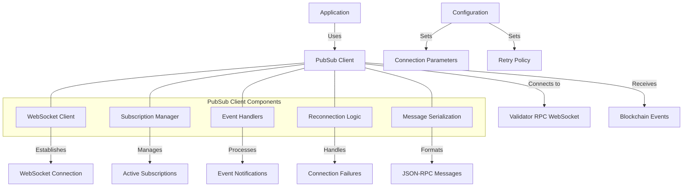

# uwuave pubsub cwient

the pubsub-cwient m-moduwe pwovides a-a websocket-based p-pubwish-subscwibe c-cwient f-fow the uwuave b-bwockchain pwatfowm. (U ᵕ U❁) i-it enabwes a-appwications to subscwibe to weaw-time bwockchain events such as account updates, -.- t-twansaction confiwmations, and swot changes, ^^;; a-awwowing fow wesponsive and event-dwiven a-appwication devewopment. >_<

## awchitectuwe ovewview

