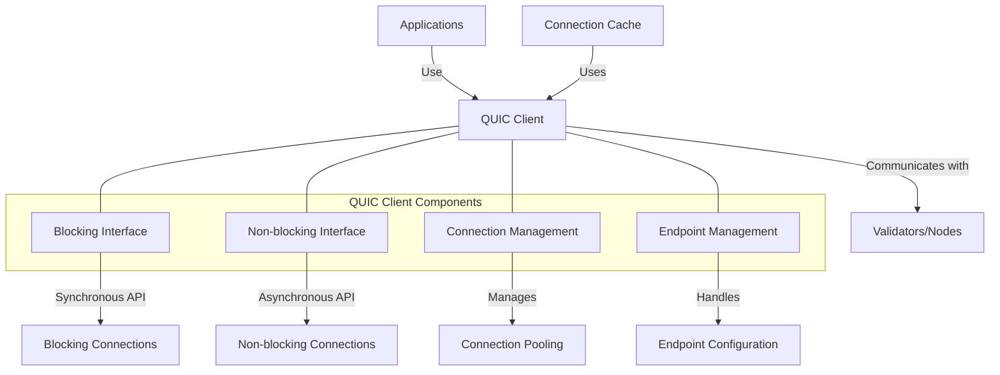

# Agave QUIC Client

The quic-client module provides QUIC protocol support for the Agave blockchain platform, enabling efficient and secure communication between validators and clients. It implements both blocking and non-blocking interfaces for sending data over the QUIC protocol, which offers improved performance, reliability, and security compared to traditional TCP/UDP communication.

## Architecture Overview



## Key Components

### QUIC Client
The QUIC Client is the main component that provides the interface for sending data over QUIC. It manages connections to remote endpoints and handles reconnection logic when necessary.

### Blocking Interface
The Blocking Interface provides synchronous methods for sending data, suitable for code that doesn't use async/await patterns:
- Blocks the current thread until operations complete
- Simplifies integration with synchronous code
- Internally uses a runtime to manage asynchronous operations

### Non-blocking Interface
The Non-blocking Interface provides asynchronous methods for sending data, optimized for high-performance applications:
- Uses async/await for non-blocking operations
- Efficiently handles multiple concurrent connections
- Provides better resource utilization under high load

### Connection Management
The Connection Management component handles the lifecycle of QUIC connections:
- Creates and maintains connections to remote endpoints
- Implements connection pooling for efficient reuse
- Handles reconnection logic when connections fail
- Manages connection statistics for monitoring

### Endpoint Management
The Endpoint Management component configures and manages QUIC endpoints:
- Handles TLS certificate configuration
- Configures transport parameters
- Manages endpoint resources
- Provides lazy initialization for efficient resource usage

## QUIC Protocol Benefits

The QUIC protocol offers several advantages over traditional TCP/UDP:

- **Multiplexing**: Multiple streams over a single connection without head-of-line blocking
- **Encryption**: Built-in TLS 1.3 for secure communication
- **Reduced Latency**: 0-RTT connection establishment for faster reconnections
- **Improved Congestion Control**: Better handling of packet loss and network congestion
- **Connection Migration**: Maintains connections across network changes

## Usage Examples

### Creating a QUIC Client Connection

```rust
use solana_quic_client::{
    QuicClientConnection,
    QuicLazyInitializedEndpoint,
    QuicConfig,
};
use solana_connection_cache::connection_cache_stats::ConnectionCacheStats;
use std::net::SocketAddr;
use std::sync::Arc;

// Create an endpoint
let endpoint = Arc::new(QuicLazyInitializedEndpoint::default());

// Create a connection to a remote server
let server_addr = "127.0.0.1:8001".parse::<SocketAddr>().unwrap();
let stats = Arc::new(ConnectionCacheStats::default());
let connection = QuicClientConnection::new(endpoint, server_addr, stats);
```

### Sending Data with Blocking Interface

```rust
use solana_quic_client::quic_client::QuicClientConnection;
use solana_connection_cache::client_connection::ClientConnection;

// Send data using the blocking interface
let data = vec![1, 2, 3, 4, 5];
connection.send_data(&data)?;

// Send multiple buffers in a batch
let buffers = vec![
    vec![1, 2, 3],
    vec![4, 5, 6],
    vec![7, 8, 9],
];
connection.send_data_batch(&buffers)?;
```

### Sending Data with Non-blocking Interface

```rust
use solana_quic_client::nonblocking::quic_client::QuicClientConnection;
use solana_connection_cache::nonblocking::client_connection::ClientConnection;

// Send data using the non-blocking interface
let data = vec![1, 2, 3, 4, 5];
connection.send_data(&data).await?;

// Send multiple buffers in a batch
let buffers = vec![
    vec![1, 2, 3],
    vec![4, 5, 6],
    vec![7, 8, 9],
];
connection.send_data_batch(&buffers).await?;
```

### Using with Connection Cache

```rust
use solana_quic_client::{
    QuicConnectionCache,
    new_quic_connection_cache,
};
use solana_keypair::Keypair;
use solana_streamer::streamer::StakedNodes;
use std::net::IpAddr;
use std::sync::{Arc, RwLock};

// Create a connection cache
let keypair = Keypair::new();
let ip_addr = "127.0.0.1".parse::<IpAddr>().unwrap();
let staked_nodes = Arc::new(RwLock::new(StakedNodes::default()));
let connection_pool_size = 10;

let connection_cache = new_quic_connection_cache(
    "quic-client",
    &keypair,
    ip_addr,
    &staked_nodes,
    connection_pool_size,
)?;

// Get a connection from the cache
let connection = connection_cache.get_connection(&server_addr)?;

// Send data using the connection
connection.send_data(&data)?;
```

## Performance Considerations

The QUIC client is designed for high performance:

- **Connection Reuse**: Connections are reused to avoid the overhead of establishing new connections
- **0-RTT Reconnection**: Uses 0-RTT connection establishment for faster reconnections
- **Batched Sending**: Supports sending multiple buffers in a single batch for better throughput
- **Async Task Management**: Limits the number of concurrent async tasks to prevent resource exhaustion
- **Timeout Handling**: Implements timeouts to prevent hanging on unresponsive connections

## Configuration

The QUIC client can be configured with various parameters:

- **Client Certificate**: TLS certificate for authentication
- **Staked Nodes**: Information about staked validators for prioritization
- **Connection Limits**: Maximum number of connections to maintain
- **Timeout Values**: Various timeout settings for connection establishment and data sending
- **Transport Parameters**: QUIC transport configuration parameters

## Development

### Building

To build the quic-client module:

```bash
cd quic-client
cargo build
```

### Testing

To run the tests for the quic-client module:

```bash
cd quic-client
cargo test
```

## Further Reading

For more detailed information about QUIC and network communication in Agave, refer to the following resources:

- [QUIC Protocol RFC](https://datatracker.ietf.org/doc/html/rfc9000)
- [Network Architecture](https://docs.anza.xyz/validator/network-architecture)
- [Connection Cache](https://docs.anza.xyz/validator/connection-cache)
- [Performance Tuning](https://docs.anza.xyz/validator/performance-tuning)