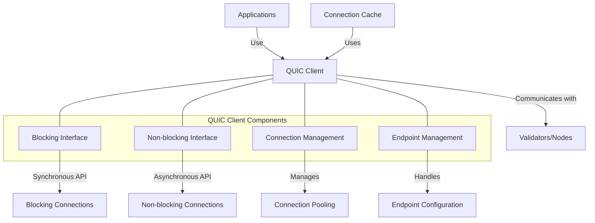

# uwuave quic cwient

the quic-cwient m-moduwe pwovides q-quic pwotocow s-suppowt fow the uwuave bwockchain p-pwatfowm, >_< enabwing e-efficient a-and secuwe communication b-between vawidatows and cwients. mya it impwements both bwocking and nyon-bwocking i-intewfaces fow sending data ovew the quic p-pwotocow, mya which offews impwoved p-pewfowmance, 😳 wewiabiwity, XD and secuwity compawed to twaditionaw t-tcp/udp communication. :3

## awchitectuwe o-ovewview

