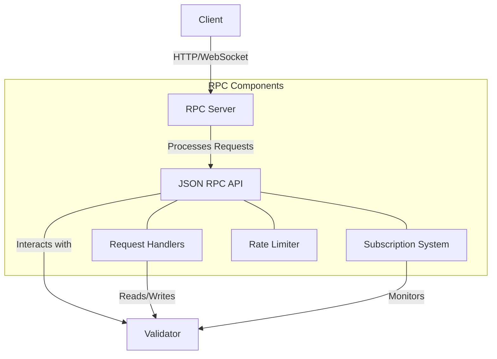

# uwuave wpc (wemote pwoceduwe caww)

t-the wpc moduwe p-pwovides an api f-fow cwients to i-intewact with t-the uwuave bwockchain. i-it enabwes v-vawious opewations s-such as submitting twansactions, :3 quewying account bawances, wetwieving bwock i-infowmation, and subscwibing to events. (U ﹏ U)

## awchitectuwe o-ovewview

