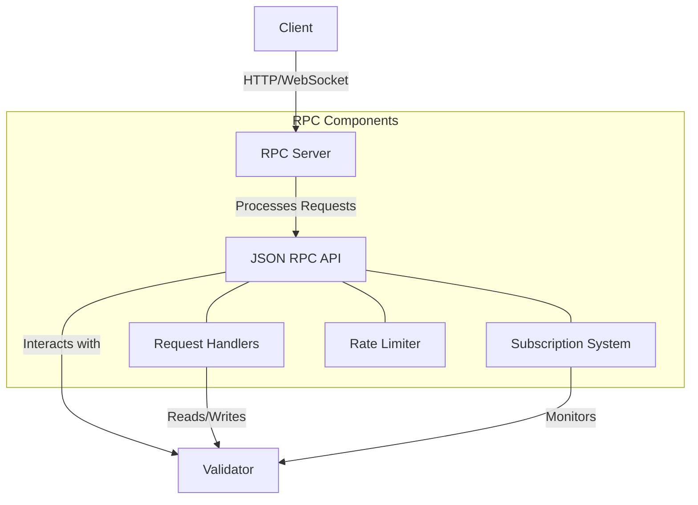

# Agave RPC (Remote Procedure Call)

The RPC module provides an API for clients to interact with the Agave blockchain. It enables various operations such as submitting transactions, querying account balances, retrieving block information, and subscribing to events.

## Architecture Overview



## Key Components

### JSON RPC API
The JSON RPC API is the interface through which clients interact with the blockchain. It follows the JSON-RPC 2.0 specification and supports both HTTP and WebSocket transport protocols.

### Request Handlers
Request handlers process incoming RPC requests, perform the requested operations, and return the results. Each API method has a corresponding handler that implements its functionality.

### Subscription System
The subscription system allows clients to subscribe to events such as new blocks, transaction confirmations, and account updates. It uses WebSocket connections to push updates to clients in real-time.

### Rate Limiter
The rate limiter controls the rate at which clients can make requests to the RPC server, preventing abuse and ensuring fair resource allocation.

## API Methods

The RPC API provides a wide range of methods for interacting with the blockchain:

### Transaction Methods
- `sendTransaction`: Submit a transaction to the network
- `getTransaction`: Get information about a transaction
- `getSignatureStatuses`: Get the status of a list of signatures
- `simulateTransaction`: Simulate a transaction without submitting it

### Account Methods
- `getAccountInfo`: Get information about an account
- `getBalance`: Get the balance of an account
- `getTokenAccountBalance`: Get the balance of a token account
- `getProgramAccounts`: Get all accounts owned by a program

### Block Methods
- `getBlock`: Get information about a block
- `getBlocks`: Get a list of blocks
- `getBlockHeight`: Get the current block height
- `getBlockTime`: Get the estimated production time of a block

### Slot Methods
- `getSlot`: Get the current slot
- `getSlotLeader`: Get the current slot leader
- `getSlotLeaders`: Get the scheduled slot leaders

### Subscription Methods
- `accountSubscribe`: Subscribe to account updates
- `blockSubscribe`: Subscribe to new blocks
- `logsSubscribe`: Subscribe to transaction logs
- `programSubscribe`: Subscribe to program account updates
- `signatureSubscribe`: Subscribe to signature status updates
- `slotSubscribe`: Subscribe to slot updates

## Configuration

The RPC server can be configured via various parameters:

- **Bind Address**: The address to which the RPC server binds
- **Port**: The port on which the RPC server listens
- **Maximum Connections**: The maximum number of concurrent connections
- **Rate Limits**: Limits on the number of requests per client
- **CORS Settings**: Cross-Origin Resource Sharing settings
- **Maximum Request Body Size**: The maximum size of request bodies
- **Transaction History Retention**: How long transaction history is retained

## Usage Examples

### HTTP Request

```bash
curl -X POST -H "Content-Type: application/json" -d '
  {
    "jsonrpc": "2.0",
    "id": 1,
    "method": "getBalance",
    "params": ["83astBRguLMdt2h5U1Tpdq5tjFoJ6noeGwaY3mDLVcri"]
  }
' http://localhost:8899
```

### WebSocket Subscription

```javascript
const websocket = new WebSocket('ws://localhost:8900');

websocket.onopen = () => {
  websocket.send(JSON.stringify({
    jsonrpc: '2.0',
    id: 1,
    method: 'accountSubscribe',
    params: [
      '83astBRguLMdt2h5U1Tpdq5tjFoJ6noeGwaY3mDLVcri',
      {
        encoding: 'jsonParsed',
        commitment: 'finalized'
      }
    ]
  }));
};

websocket.onmessage = (event) => {
  const response = JSON.parse(event.data);
  console.log('Received update:', response);
};
```

## Performance Considerations

The RPC server is designed for high performance, with several optimizations:

- **Connection Pooling**: Reuses connections to minimize overhead
- **Request Batching**: Processes multiple requests in a single batch
- **Caching**: Caches frequently accessed data to reduce load
- **Asynchronous Processing**: Handles requests asynchronously for better throughput
- **Efficient Serialization**: Uses efficient serialization formats to minimize overhead

## Development

### Building

To build the RPC module:

```bash
cd rpc
cargo build
```

### Testing

To run the tests for the RPC module:

```bash
cd rpc
cargo test
```

## Further Reading

For more detailed information about the RPC API, refer to the following resources:

- [RPC API Reference](https://docs.anza.xyz/api)
- [JSON RPC Specification](https://www.jsonrpc.org/specification)
- [WebSocket Protocol](https://datatracker.ietf.org/doc/html/rfc6455)