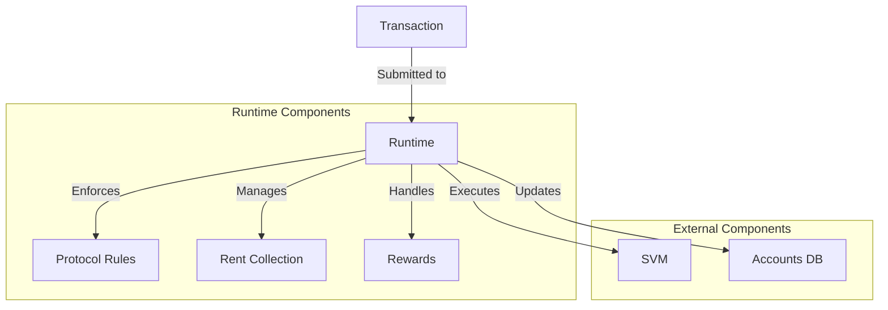

# Agave Runtime

The runtime module is a critical component of the Agave blockchain platform, responsible for executing transactions, managing the blockchain state, and enforcing the rules of the protocol. It serves as the execution environment for the blockchain and interacts closely with the SVM (Solana Virtual Machine) to execute smart contracts.

## Architecture Overview



## Key Components

### Transaction Execution
The runtime is responsible for executing transactions, which involves:
- Verifying transaction signatures
- Checking account balances and permissions
- Executing program instructions via the SVM
- Updating account states
- Handling transaction fees

### State Management
The runtime manages the state of the blockchain, including:
- Account data and balances
- Program data
- Epoch information
- Stake and delegation data

### Rent Collection
The runtime implements the rent mechanism, which requires accounts to pay rent based on their size to maintain their data on the blockchain. Accounts that don't maintain sufficient balance to pay rent may be purged.

### Rewards Distribution
The runtime handles the distribution of rewards to validators and delegators based on their stake and participation in consensus.

### Protocol Rule Enforcement
The runtime enforces the rules of the Agave protocol, ensuring that all transactions and state changes adhere to the consensus rules.

## Transaction Flow

1. **Transaction Submission**: A transaction is submitted to the network
2. **Signature Verification**: The runtime verifies the transaction signatures
3. **Account Verification**: The runtime checks that the accounts have sufficient balance and permissions
4. **Instruction Execution**: The runtime executes each instruction in the transaction via the SVM
5. **State Update**: The runtime updates the state of the accounts based on the execution results
6. **Fee Collection**: The runtime collects transaction fees
7. **Result Reporting**: The runtime reports the transaction result (success or failure)

## Interaction with Other Components

### SVM (Solana Virtual Machine)
The runtime interacts with the SVM to execute program instructions. It provides the SVM with the necessary context, including account data and instruction parameters.

### Accounts DB
The runtime interacts with the Accounts DB to read and write account data. It uses various optimizations to minimize disk I/O and improve performance.

### Ledger
The runtime interacts with the ledger to persist state changes and transaction results.

### Banking Stage
The runtime is used by the Banking Stage to process transactions before they are included in blocks.

## Performance Optimizations

The runtime includes various optimizations to maximize throughput and minimize latency:

- **Parallel Transaction Processing**: The runtime can process multiple transactions in parallel, as long as they don't access the same accounts
- **Account Caching**: The runtime caches account data to minimize disk I/O
- **Incremental Snapshots**: The runtime supports incremental snapshots to reduce the time and resources required for state synchronization
- **Prioritization**: The runtime can prioritize transactions based on various factors, such as fees and account access patterns

## Configuration

The runtime can be configured via various parameters, including:

- **Accounts Index Memory Limit**: Controls the maximum memory usage for the accounts index
- **Accounts Hash Verification Frequency**: Controls how often the accounts hash is verified
- **Snapshot Configuration**: Controls how and when snapshots are created
- **Rent Collection Configuration**: Controls how rent is collected from accounts

## Development

### Building

To build the runtime module:

```bash
cd runtime
cargo build
```

### Testing

To run the tests for the runtime module:

```bash
cd runtime
cargo test
```

### Benchmarking

The runtime module includes benchmarks for performance-critical components:

```bash
cd runtime
cargo bench
```

## Further Reading

For more detailed information about the runtime, refer to the following resources:

- [Runtime Architecture](https://docs.anza.xyz/validator/runtime)
- [Transaction Processing](https://docs.anza.xyz/validator/transaction-processing)
- [State Management](https://docs.anza.xyz/validator/state-management)
- [Rent Economics](https://docs.anza.xyz/economics/rent)