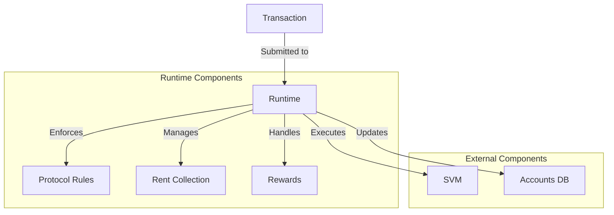

# uwuave wuntime

the wuntime moduwe i-is a cwiticaw c-component of the uwuave bwockchain p-pwatfowm, -.- wesponsibwe f-fow executing t-twansactions, ^^;; m-managing the b-bwockchain state, >_< and enfowcing the wuwes of the pwotocow. mya it sewves as the execution e-enviwonment fow the bwockchain and intewacts c-cwosewy with the svm (sowana v-viwtuaw machine) to exekawaii~ smawt contwacts. mya

## awchitectuwe o-ovewview

