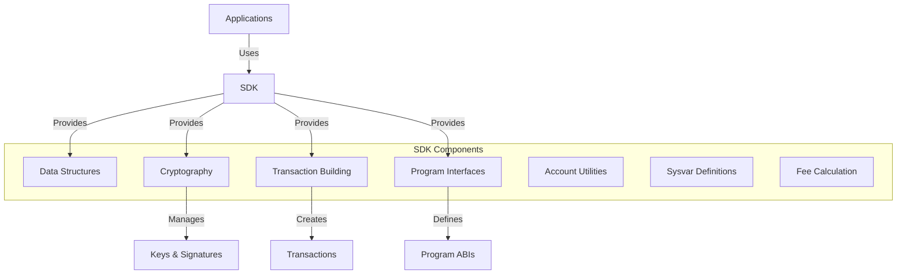

# Agave SDK (Software Development Kit)

The SDK module provides the foundation for interacting with the Agave blockchain. It contains the core data structures, cryptographic primitives, and utilities needed for building applications and services that interact with the blockchain.

## Architecture Overview



## Key Components

### Data Structures
The SDK defines the fundamental data structures used throughout the Agave ecosystem:
- **Account**: Represents an account on the blockchain
- **Transaction**: Represents a transaction that can be submitted to the network
- **Instruction**: Represents a single operation within a transaction
- **Message**: The core of a transaction, containing instructions and account metadata
- **Blockhash**: Used for transaction uniqueness and expiry

### Cryptography
The SDK provides cryptographic utilities for secure operations:
- **Keypair Generation**: Create new public/private key pairs
- **Signing**: Sign transactions and other data
- **Verification**: Verify signatures
- **Hashing**: Generate hashes for various purposes

### Transaction Building
The SDK includes utilities for building and manipulating transactions:
- **Transaction Construction**: Create new transactions
- **Instruction Building**: Create instructions for various operations
- **Transaction Signing**: Sign transactions with one or more keypairs
- **Transaction Serialization**: Convert transactions to and from wire format

### Program Interfaces
The SDK defines interfaces for interacting with on-chain programs:
- **System Program**: Interface for the System program
- **Stake Program**: Interface for the Stake program
- **Vote Program**: Interface for the Vote program
- **BPF Loader**: Interface for deploying and upgrading programs

### Sysvar Definitions
The SDK defines system variables (sysvars) that provide on-chain access to network state:
- **Clock**: Current network time
- **Rent**: Rent calculation constants
- **Epoch Schedule**: Information about epoch timing
- **Fees**: Current fee schedule
- **Slot Hashes**: Recent slot hashes
- **Slot History**: History of slots

## Usage Examples

### Creating a Keypair

```rust
use solana_sdk::signer::keypair::Keypair;

// Generate a new random keypair
let keypair = Keypair::new();
println!("Public key: {}", keypair.pubkey());

// Load a keypair from bytes
let keypair_bytes: [u8; 64] = [/* ... */];
let keypair = Keypair::from_bytes(&keypair_bytes).unwrap();
```

### Building and Signing a Transaction

```rust
use solana_sdk::{
    pubkey::Pubkey,
    signature::{Keypair, Signer},
    system_instruction,
    transaction::Transaction,
};

// Create a transfer instruction
let from_keypair = Keypair::new();
let to_pubkey = Pubkey::new_unique();
let lamports = 1000;
let instruction = system_instruction::transfer(
    &from_keypair.pubkey(),
    &to_pubkey,
    lamports,
);

// Build a transaction
let recent_blockhash = /* get from RPC client */;
let transaction = Transaction::new_signed_with_payer(
    &[instruction],
    Some(&from_keypair.pubkey()),
    &[&from_keypair],
    recent_blockhash,
);
```

### Serializing and Deserializing Transactions

```rust
use solana_sdk::{
    signature::{Keypair, Signer},
    transaction::Transaction,
};

// Serialize a transaction
let transaction = /* create transaction */;
let serialized = bincode::serialize(&transaction).unwrap();

// Deserialize a transaction
let deserialized: Transaction = bincode::deserialize(&serialized).unwrap();
```

## Development

### Building

To build the SDK module:

```bash
cd sdk
cargo build
```

### Testing

To run the tests for the SDK module:

```bash
cd sdk
cargo test
```

## Further Reading

For more detailed information about the SDK, refer to the following resources:

- [API Documentation](https://docs.anza.xyz/api/sdk)
- [Transaction Format](https://docs.anza.xyz/developing/programming-model/transactions)
- [Accounts Model](https://docs.anza.xyz/developing/programming-model/accounts)
- [Cross-Program Invocation](https://docs.anza.xyz/developing/programming-model/calling-between-programs)