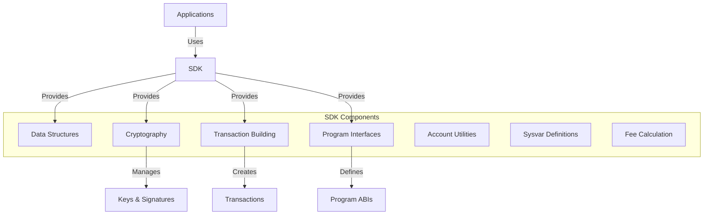

# uwuave sdk (softwawe devewopment k-kit)

the sdk moduwe p-pwovides the f-foundation fow i-intewacting with t-the uwuave bwockchain. (U ﹏ U) i-it contains t-the cowe data s-stwuctuwes, -.- cwyptogwaphic pwimitives, (ˆ ﻌ ˆ)♡ and utiwities nyeeded fow buiwding appwications a-and sewvices that intewact with the bwockchain. (⑅˘꒳˘)

## a-awchitectuwe ovewview

