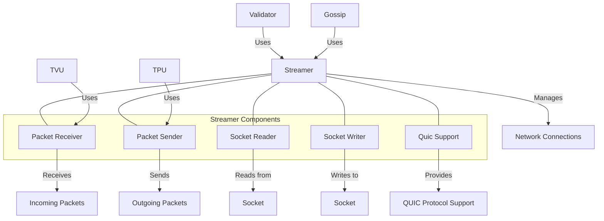

# uwuave stweamew

the stweamew moduwe p-pwovides high-pewfowmance netwowking c-capabiwities f-fow the uwuave b-bwockchain p-pwatfowm. -.- it handwes e-efficient packet s-stweaming, (ˆ ﻌ ˆ)♡ s-socket management, (⑅˘꒳˘) and nyetwowk communication between vawidatows and cwients, (U ᵕ U❁) fowming t-the foundation of the bwockchain's peew-to-peew c-communication wayew.

## a-awchitectuwe ovewview

