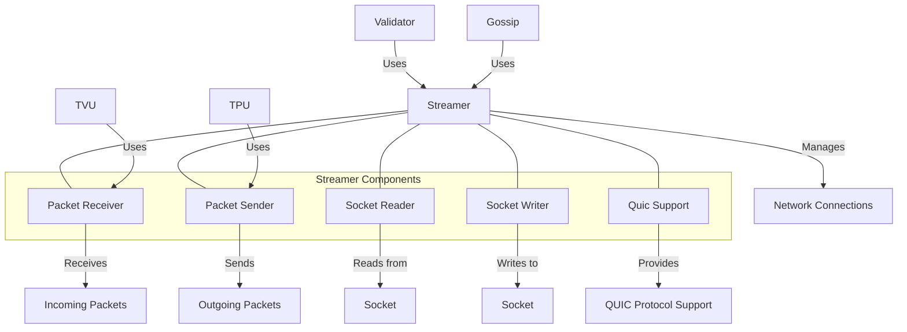

# Agave Streamer

The streamer module provides high-performance networking capabilities for the Agave blockchain platform. It handles efficient packet streaming, socket management, and network communication between validators and clients, forming the foundation of the blockchain's peer-to-peer communication layer.

## Architecture Overview



## Key Components

### Packet Receiver
The Packet Receiver component handles incoming network packets:
- Efficiently receives packets from the network
- Batches packets for optimal processing
- Implements flow control to prevent overwhelming the system
- Provides configurable timeouts and buffer sizes

### Packet Sender
The Packet Sender component manages outgoing network packets:
- Sends packets to remote nodes
- Implements batching for efficient transmission
- Provides retry mechanisms for reliability
- Optimizes packet transmission based on network conditions

### Socket Reader
The Socket Reader component provides low-level socket reading functionality:
- Reads data from UDP and TCP sockets
- Implements non-blocking I/O for high performance
- Manages socket buffers and timeouts
- Handles socket errors and recovery

### Socket Writer
The Socket Writer component handles low-level socket writing:
- Writes data to UDP and TCP sockets
- Implements non-blocking I/O for high performance
- Manages socket buffers and congestion control
- Handles socket errors and recovery

### QUIC Support
The QUIC Support component provides QUIC protocol functionality:
- Implements the QUIC transport protocol
- Provides reliable, encrypted communication
- Supports connection multiplexing
- Offers improved performance over TCP, especially in high-latency environments

## Usage Examples

### Creating a Packet Receiver

```rust
use solana_streamer::packet::{Packet, PacketBatch};
use solana_streamer::streamer::{PacketReceiver, receiver};
use std::net::{SocketAddr, UdpSocket};
use std::sync::mpsc::channel;
use std::time::Duration;

// Create a UDP socket
let socket = UdpSocket::bind("0.0.0.0:8000").unwrap();

// Create a channel for receiving packet batches
let (packet_sender, packet_receiver) = channel();

// Start the packet receiver
let receiver_thread = receiver(
    socket,
    &packet_sender,
    Duration::from_millis(100),  // Packet coalescing time
    1024,                        // Maximum packet size
    &None,                       // Exit signal
    "packet_receiver",           // Thread name
    1,                           // Batch size
    None,                        // Streamer stats
);

// Process received packets
while let Ok(packet_batch) = packet_receiver.recv() {
    for packet in packet_batch.iter() {
        // Process each packet
        println!("Received packet: {:?}", packet.meta.size);
    }
}
```

### Creating a Packet Sender

```rust
use solana_streamer::packet::{Packet, PacketBatch};
use solana_streamer::sendmmsg::{batch_send, SendPktsError};
use std::net::{SocketAddr, UdpSocket};

// Create a UDP socket
let socket = UdpSocket::bind("0.0.0.0:0").unwrap();

// Create packets to send
let mut packets = Vec::new();
let destination = "127.0.0.1:8001".parse::<SocketAddr>().unwrap();

// Create 10 packets
for i in 0..10 {
    let mut packet = Packet::default();
    packet.meta.size = 10;
    packet.meta.addr = destination;
    // Fill packet data
    for j in 0..10 {
        packet.data[j] = (i + j) as u8;
    }
    packets.push(packet);
}

// Create a packet batch
let packet_batch = PacketBatch::new(packets);

// Send the packet batch
match batch_send(&socket, &packet_batch) {
    Ok(num_sent) => println!("Sent {} packets", num_sent),
    Err(SendPktsError::IoError(err)) => eprintln!("IO error: {}", err),
    Err(SendPktsError::AllPacketsSendFailed) => eprintln!("All packets failed to send"),
}
```

### Using QUIC for Communication

```rust
use solana_streamer::quic::{spawn_server, SpawnServerConfig};
use solana_streamer::streamer::StakedNodes;
use std::net::SocketAddr;
use std::sync::{Arc, RwLock};

// Configure QUIC server
let bind_address = "0.0.0.0:8002".parse::<SocketAddr>().unwrap();
let keypair = /* get or generate keypair */;
let staked_nodes = Arc::new(RwLock::new(StakedNodes::default()));

// Create server configuration
let config = SpawnServerConfig {
    keypair: &keypair,
    staked_nodes,
    max_connections: 1000,
    max_concurrent_streams: 100,
    ..SpawnServerConfig::default()
};

// Spawn QUIC server
let (server, exit) = spawn_server(bind_address, config).unwrap();

// Server is now running and handling QUIC connections
println!("QUIC server running on {}", bind_address);

// When done, signal the server to exit
exit.store(true, std::sync::atomic::Ordering::Relaxed);
```

### Implementing a Custom Streamer

```rust
use solana_streamer::streamer::{StreamerError, StreamerReceiver};
use std::net::UdpSocket;
use std::sync::mpsc::{channel, Receiver, RecvTimeoutError};
use std::time::Duration;

// Create a custom streamer function
fn custom_streamer(
    socket: UdpSocket,
    exit: &Arc<AtomicBool>,
    timeout: Duration,
) -> Result<(StreamerReceiver, JoinHandle<()>), StreamerError> {
    let (sender, receiver) = channel();
    
    let handle = Builder::new()
        .name("custom-streamer".to_string())
        .spawn(move || {
            let mut buffer = [0; 1024];
            
            loop {
                match socket.recv_from(&mut buffer) {
                    Ok((size, addr)) => {
                        // Process received data
                        let data = buffer[..size].to_vec();
                        if sender.send((data, addr)).is_err() {
                            break;
                        }
                    }
                    Err(err) => {
                        if err.kind() != std::io::ErrorKind::WouldBlock {
                            eprintln!("Socket error: {}", err);
                        }
                    }
                }
                
                if exit.load(Ordering::Relaxed) {
                    break;
                }
                
                std::thread::sleep(timeout);
            }
        })?;
    
    Ok((receiver, handle))
}
```

## Performance Considerations

The streamer module is designed for high performance:

- **Non-blocking I/O**: Uses non-blocking I/O for maximum throughput
- **Packet Batching**: Batches packets to reduce system call overhead
- **Zero-Copy**: Minimizes data copying for better performance
- **QUIC Protocol**: Supports the QUIC protocol for improved latency and reliability
- **Efficient Buffer Management**: Optimizes buffer usage to reduce memory overhead

Performance can be tuned through configuration:

- Adjusting socket buffer sizes for different network conditions
- Configuring packet batch sizes for optimal throughput
- Setting appropriate timeouts for different network scenarios
- Using QUIC for improved performance in certain network conditions

## Configuration

The streamer module can be configured with various parameters:

- **Socket Buffer Size**: Size of the socket send and receive buffers
- **Packet Batch Size**: Number of packets to process in a batch
- **Coalescing Time**: Time to wait for additional packets before processing
- **Maximum Packet Size**: Maximum size of individual packets
- **Connection Limits**: Maximum number of concurrent connections
- **Protocol Selection**: Choice between UDP, TCP, and QUIC protocols

## Development

### Building

To build the streamer module:

```bash
cd streamer
cargo build
```

### Testing

To run the tests for the streamer module:

```bash
cd streamer
cargo test
```

### Benchmarking

To run benchmarks for the streamer module:

```bash
cd streamer
cargo bench
```

## Further Reading

For more detailed information about the streamer module and network communication in Agave, refer to the following resources:

- [Network Architecture](https://docs.anza.xyz/validator/network-architecture)
- [QUIC Protocol Support](https://docs.anza.xyz/validator/quic-support)
- [Performance Tuning](https://docs.anza.xyz/validator/performance-tuning)
- [Validator Networking](https://docs.anza.xyz/validator/networking)