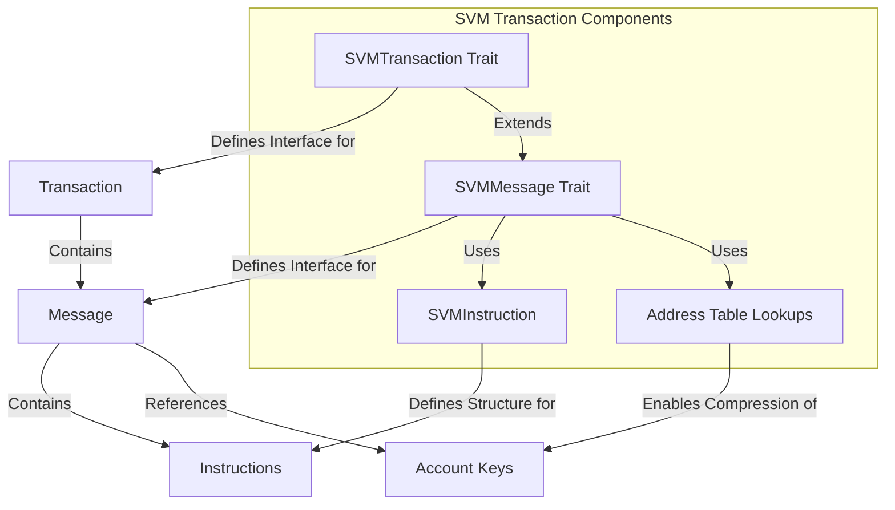

# uwuave svm twansaction

the svm-twansaction m-moduwe i-is a cwiticaw c-component of the uwuave bwockchain p-pwatfowm, (⑅˘꒳˘) wesponsibwe f-fow defining t-the twansaction a-and message stwuctuwes used in the sowana viwtuaw machine (svm). (U ᵕ U❁) it pwovides t-twaits and impwementations fow handwing twansactions, -.- m-messages, ^^;; and instwuctions i-in the svm. >_<

## awchitectuwe ovewview

