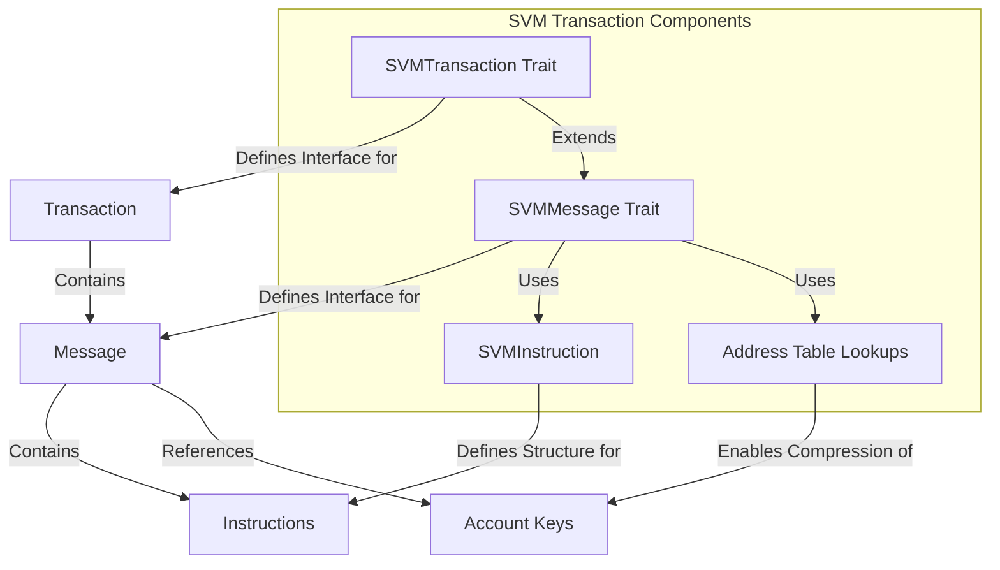

# Agave SVM Transaction

The svm-transaction module is a critical component of the Agave blockchain platform, responsible for defining the transaction and message structures used in the Solana Virtual Machine (SVM). It provides traits and implementations for handling transactions, messages, and instructions in the SVM.

## Architecture Overview



## Key Components

### SVMTransaction Trait
The SVMTransaction trait defines the interface for transaction objects in the SVM. It extends the SVMMessage trait and adds methods for accessing transaction signatures:
- `signature()` - Get the first signature of the message
- `signatures()` - Get all the signatures of the message

This trait is implemented by transaction types that represent executable units of work on the blockchain.

### SVMMessage Trait
The SVMMessage trait defines the interface for message objects in the SVM. It includes methods for:
- Accessing account keys and instructions
- Checking account permissions (signer, writable)
- Retrieving the recent blockhash
- Counting various types of signatures (transaction, ed25519, secp256k1, secp256r1)
- Handling durable nonces
- Managing address table lookups

This trait provides a common interface for different message formats (legacy, v0, etc.).

### SVMInstruction
The SVMInstruction structure represents an instruction in the SVM. It is a non-owning version of CompiledInstruction that references slices of account indexes and data:
- `program_id_index` - Index into the transaction keys array indicating the program account that executes this instruction
- `accounts` - Ordered indices into the transaction keys array indicating which accounts to pass to the program
- `data` - The program input data

This structure is used to efficiently represent instructions without unnecessary copying of data.

### Message Address Table Lookups
The message address table lookups functionality enables compression of transaction size by allowing transactions to reference accounts through address lookup tables instead of including full public keys.

This is particularly useful for transactions that need to reference many accounts, as it significantly reduces the transaction size and therefore the cost of the transaction.

## Transaction Processing Flow

1. **Transaction Creation**: A transaction is created with a message and signatures
2. **Message Compilation**: The message is compiled into a format that can be executed by the SVM
3. **Instruction Extraction**: Instructions are extracted from the message
4. **Account Resolution**: Account keys are resolved, including any address table lookups
5. **Permission Checking**: Account permissions (signer, writable) are checked
6. **Instruction Execution**: Instructions are executed by their respective programs
7. **Result Recording**: The results of the transaction execution are recorded

## Usage Examples

### Working with SVMTransaction

```rust
use solana_svm_transaction::svm_transaction::SVMTransaction;

// Get the first signature of a transaction
let signature = transaction.signature();

// Get all signatures of a transaction
let signatures = transaction.signatures();
```

### Working with SVMMessage

```rust
use solana_svm_transaction::svm_message::SVMMessage;

// Get the recent blockhash from a message
let blockhash = message.recent_blockhash();

// Check if an account is writable
let is_writable = message.is_writable(account_index);

// Check if an account is a signer
let is_signer = message.is_signer(account_index);

// Get the fee payer
let fee_payer = message.fee_payer();

// Iterate over instructions
for instruction in message.instructions_iter() {
    // Process instruction
}

// Get the number of write locks
let num_write_locks = message.num_write_locks();
```

### Working with SVMInstruction

```rust
use solana_svm_transaction::instruction::SVMInstruction;
use solana_message::compiled_instruction::CompiledInstruction;

// Create an SVMInstruction from a CompiledInstruction
let compiled_instruction = CompiledInstruction {
    program_id_index: 0,
    accounts: vec![1, 2, 3],
    data: vec![0, 1, 2, 3],
};
let svm_instruction = SVMInstruction::from(&compiled_instruction);

// Access instruction fields
let program_id_index = svm_instruction.program_id_index;
let accounts = svm_instruction.accounts;
let data = svm_instruction.data;
```

## Development

### Building

To build the svm-transaction module:

```bash
cd svm-transaction
cargo build
```

### Testing

To run the tests for the svm-transaction module:

```bash
cd svm-transaction
cargo test
```

## Further Reading

For more detailed information about SVM transactions, refer to the following resources:

- [Transaction Format](https://docs.anza.xyz/developing/programming-model/transactions)
- [Address Lookup Tables](https://docs.anza.xyz/developing/programming-model/lookup-tables)
- [Transaction Processing](https://docs.anza.xyz/validator/transaction-processing)
- [SVM Architecture](https://docs.anza.xyz/validator/runtime)