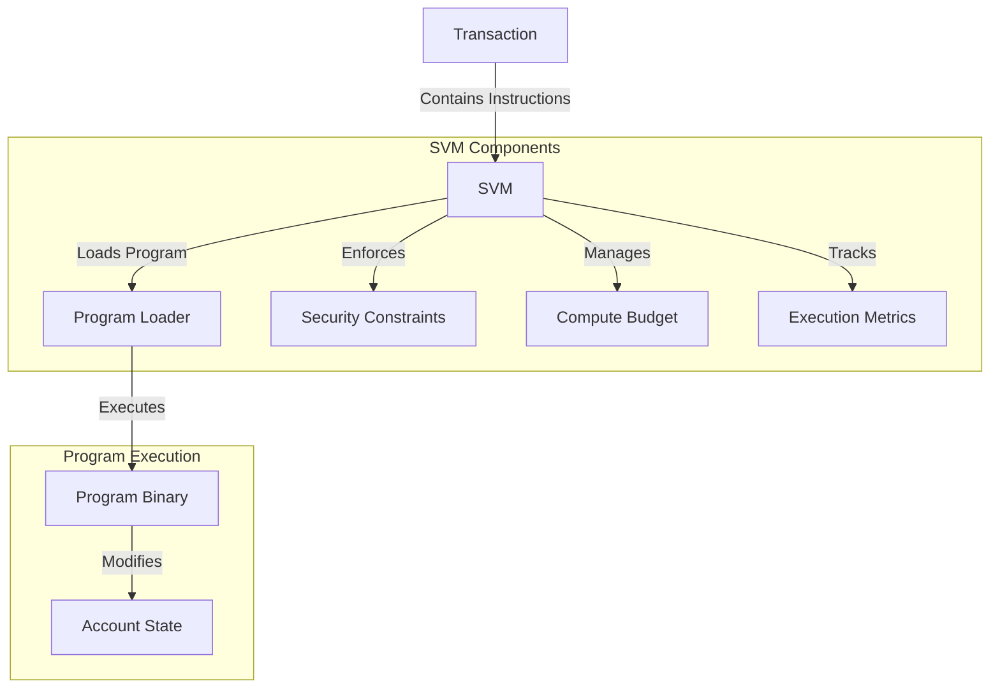

# Solana Virtual Machine (SVM)

The Solana Virtual Machine (SVM) is the execution environment for smart contracts (programs) on the Agave blockchain. It is responsible for executing program instructions, managing program state, and enforcing security constraints.

## Architecture Overview



## Key Components

### Program Execution
The SVM executes program instructions contained in transactions. Each instruction specifies a program to execute, the accounts it can access, and the instruction data.

### Program Loaders
The SVM supports different program loaders, which are responsible for loading and executing program binaries:

- **BPF Loader**: The original program loader that executes BPF (Berkeley Packet Filter) bytecode
- **Loader v4**: A newer program loader with improved performance and features

### Security Model
The SVM enforces a strict security model to ensure that programs can only access the accounts they are explicitly granted access to. This prevents unauthorized access to account data and helps maintain the integrity of the blockchain.

### Compute Budget
The SVM enforces a compute budget for each transaction to prevent infinite loops and ensure fair resource allocation. Programs that exceed their compute budget will have their execution terminated.

### Cross-Program Invocation (CPI)
The SVM allows programs to invoke other programs, enabling composability and reuse of functionality. This is known as Cross-Program Invocation (CPI) and is a key feature of the Solana programming model.

## Program Development

### Supported Languages
Programs for the SVM can be written in various languages:

- **Rust**: The primary language for Solana program development, offering the best performance and safety guarantees
- **C/C++**: Supported for programs that need low-level control or have existing codebases
- **AssemblyScript**: A TypeScript-like language that compiles to WebAssembly

### Development Workflow

1. Write program code in a supported language
2. Compile the program to BPF bytecode
3. Deploy the program to the blockchain
4. Interact with the program by submitting transactions

### Example: Hello World Program in Rust

```rust
use solana_program::{
    account_info::AccountInfo,
    entrypoint,
    entrypoint::ProgramResult,
    msg,
    pubkey::Pubkey,
};

// Declare the program entrypoint
entrypoint!(process_instruction);

// Program entrypoint implementation
fn process_instruction(
    program_id: &Pubkey,
    accounts: &[AccountInfo],
    instruction_data: &[u8],
) -> ProgramResult {
    msg!("Hello, world!");
    Ok(())
}
```

## Testing and Debugging

### Local Testing
The SVM provides tools for testing programs locally before deploying them to the blockchain:

- **Program Test Framework**: A framework for writing unit tests for programs
- **Local Validator**: A local blockchain environment for integration testing

### Debugging
Debugging SVM programs can be challenging due to their execution in a sandboxed environment. The following tools can help:

- **Logging**: Programs can emit log messages using the `msg!` macro
- **Error Codes**: Programs can return custom error codes to indicate failure reasons
- **Transaction Simulation**: Transactions can be simulated without being committed to the blockchain

## Performance Considerations

### Compute Units
Each instruction in a transaction consumes compute units based on its complexity. Programs should be optimized to minimize compute unit consumption.

### Account Access
Account access patterns can significantly impact performance. Programs should minimize the number of accounts they access and prefer read-only access when possible.

### Serialization
Data serialization and deserialization can be expensive operations. Programs should use efficient serialization formats and minimize unnecessary conversions.

## Further Reading

For more detailed information about the SVM and program development, refer to the following resources:

- [SVM Architecture](https://docs.anza.xyz/developing/programming-model/overview)
- [Program Development Guide](https://docs.anza.xyz/developing/on-chain-programs/overview)
- [Security Model](https://docs.anza.xyz/developing/programming-model/accounts)
- [Compute Budget](https://docs.anza.xyz/developing/programming-model/runtime)